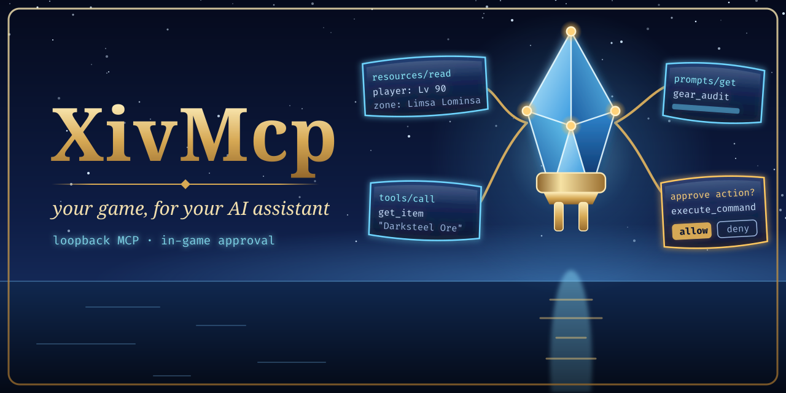

# xiv-mcp

<p align="center">
  <picture>
    <source media="(prefers-color-scheme: dark)" srcset="images/readme/hero-dark.png">
    <source media="(prefers-color-scheme: light)" srcset="images/readme/hero-light.png">
    
  </picture>
</p>


A [Model Context Protocol](https://modelcontextprotocol.io) server that runs **inside FINAL FANTASY XIV** as a
Dalamud plugin. MCP clients such as Claude Code connect to it over Streamable HTTP on loopback
(`http://127.0.0.1:41800/mcp`) and get tools, resources and prompts for game state, game data, the
player's UI and — only when the player opts in — actions and chat. An optional Umbra toolbar widget
shows server status and the agent board.

> **Status.** The plugin builds against Dalamud API 15 (Dalamud 15.0.3.4, .NET 10). The MCP runtime and
> the plugin logic that needs no game (confirmation service, chat rules, IPC payloads, map maths) have host-side
> tests, but **the plugin has not yet been observed running in the game**. Nothing below about in-game behaviour
> has been observed; treat it as the design, not as verified results.

## How it fits together

```
MCP client (Claude Code, ...)  --HTTP POST/GET/DELETE /mcp, Bearer token-->  XivMcp plugin (in game, under Wine)
                                                                               |- McpServer (XivMcp.Core, TcpListener, no ASP.NET)
                                                                               |- providers: [McpProvider] classes -> tools/resources/prompts
                                                                               |- IGameThread -> IFramework (game memory only on the framework thread)
                                                                               |- /xivmcp window, confirmation prompt, DTR entry
                                                                               '- Dalamud IPC  <-- XivMcp.Umbra widget
```

Wine maps `127.0.0.1` inside the game to the host's loopback, so host-side clients reach the plugin
directly. Details: [docs/ARCHITECTURE.md](docs/ARCHITECTURE.md).

**Before the game is launched** the same endpoint can be served by `xiv-mcp-standalone`: game-data tools work from the
installed game files, everything else answers `game_not_running`, and the plugin takes the port over when the game
starts ([docs/STANDALONE.md](docs/STANDALONE.md)). Host-tested only.

**What this will never do** — play the game for you, snipe the market, touch packets, install plugins silently — and
the one checkbox that governs approval of everything that changes state: [docs/HARD-LINES.md](docs/HARD-LINES.md).

## Install (from the plugin repository)

XivMcp is listed in the author's own third-party Dalamud repository, next to the
other FFXIV mods there. In game:

1. `/xlsettings` → **Experimental** → **Custom Plugin Repositories** → paste
   `https://spacegho.st/mods/ffxiv/plugins.json` → **+** → **Save and close**.
2. `/xlplugins` → **All Plugins** → search **XivMcp** → **Install**.

It has a stable release, so it shows up for everyone. For test builds ahead of a
release, right-click its entry → **Receive plugin testing versions**.
<https://spacegho.st/mods/ffxiv/plugins/> walks through the same steps. It is a
third-party repository: Dalamud will say nobody but the author reviewed it, which is
true. Releases are built on GitHub Actions from a tag (`.github/workflows/release.yml`);
`v1.2.3` is a stable release, `v1.2.3-test.1` moves the floating `testing` release.

You do not need any of that to run it: building it yourself, below, is the path the
author develops on, and it stays supported for anyone who wants to read the code first.

## Install (dev plugin)

Requirements: XIVLauncher.Core with Dalamud 15.0.3.5 (API 15), the .NET 10 SDK on the host (`~/.dotnet/dotnet`
is picked up automatically). Reference assemblies come from `~/.xlcore/dalamud/Hooks/dev/`; rebuild after every
Dalamud update.

```sh
tools/install-dev.sh
```

It builds Release, copies the result into `~/xiv-mcp-build/devplugin/` (so Dalamud never sees a half-written
build) and prints the Wine path of the staged DLL, e.g. `Z:\home\<you>\xiv-mcp-build\devplugin\XivMcp.dll`.
In game, once:

1. `/xlsettings` → **Experimental** → **Dev Plugin Locations**: paste that path, click **+**, then **Save and close**.
2. `/xlplugins` → **Dev Tools** → **Installed Dev Plugins**: Dalamud adds dev plugins **disabled**. Enable
   **XivMcp**, and in its entry tick **Start on boot** (otherwise it stays off after the next game start).
3. `/xivmcp` opens the window. The server starts automatically (Settings → *Start server when the
   plugin loads*).

After rebuilding, run `tools/install-dev.sh` again and reload XivMcp from `/xlplugins` (or tick its **Automatic reloading**
option). If `/xivmcp` is an unknown command, the plugin is not loaded: check steps 1–2 and the Dalamud
log (`~/.xlcore/logs/dalamud.log`, search for `XivMcp`).

The script never edits Dalamud's configuration or copies files into `~/.xlcore`. The optional Umbra
widget has its own installer (`tools/install-umbra.sh`).

## Connect a client

On first load the plugin generates a 256-bit bearer token and stores it in
`~/.xlcore/pluginConfigs/XivMcp.json`. Every request must send `Authorization: Bearer <token>`
(unless you turn *Require bearer token* off).

### Claude Code (recommended)

```sh
tools/claude-mcp-add.sh            # --force to replace an existing "xiv-mcp" entry, --dry-run to preview
```

This registers `xiv-mcp` at **user** scope with `"type": "http"` and a
[`headersHelper`](https://code.claude.com/docs/en/mcp): a small script installed to
`~/.local/share/xiv-mcp/headers-helper` that reads `BearerToken` from the plugin config each time Claude
Code connects. The token is never printed and never stored in Claude's config, and regenerating it in
game only needs a reconnect (`/mcp` in Claude Code).

Pass `--url http://<tailnet-ip>:41800/mcp` to register the tailnet endpoint instead of loopback (see
[Where the server listens](#where-the-server-listens)); on another machine the helper cannot read the
plugin config, so use the generic JSON below with the token instead.

### Anything else

The Status tab has copy buttons for a `claude mcp add --header ...` command and a generic
`mcpServers` JSON block (token masked until you reveal it):

```json
{
  "mcpServers": {
    "xiv-mcp": {
      "type": "http",
      "url": "http://127.0.0.1:41800/mcp",
      "headers": { "Authorization": "Bearer <token>" }
    }
  }
}
```

Smoke test from the host without printing the token:

```sh
TOKEN="$(python3 -c 'import json,os;print(json.load(open(os.path.expanduser("~/.xlcore/pluginConfigs/XivMcp.json"),encoding="utf-8-sig"))["BearerToken"])')"
curl -s http://127.0.0.1:41800/mcp \
  -H "Authorization: Bearer $TOKEN" -H 'Content-Type: application/json' \
  -H 'Accept: application/json, text/event-stream' \
  -d '{"jsonrpc":"2.0","id":1,"method":"initialize","params":{"protocolVersion":"2025-06-18","capabilities":{},"clientInfo":{"name":"curl","version":"0"}}}'
```

## Where the server listens

Settings → **Server** → *Where the server listens*. Changing it applies without reloading the plugin:
**Apply and restart server** stops the listener and binds the new addresses in place.

| Mode | Binds | Who can connect |
| --- | --- | --- |
| **This machine only** (default) | `127.0.0.1` | Only this computer. Under Wine that includes clients on the Linux host. |
| **This machine + my tailnet** | `127.0.0.1` **and** this machine's Tailscale address | This computer, plus anything on your tailnet that has the bearer token. |
| **Tailnet only** | the Tailscale address | Your tailnet only; local clients must use that address too. |
| **Custom address…** | whatever you type | Whatever that address is reachable from. |

The plugin finds the Tailscale address itself: it looks for an address in `100.64.0.0/10` (CGNAT) or
`fd7a:115c:a1e0::/48` on the machine's network adapters, preferring an adapter named `tailscale0`/`ts*`.
Detection runs when the server starts and whenever the settings window opens, so a Tailscale restart or a
changed address is picked up. The detected address and, when it can be read, the MagicDNS name are shown
live in Settings along with the endpoint URLs the mode produces.

**If Tailscale is not running or has no address, a tailnet mode falls back to `127.0.0.1`** and says so
in Settings, the Status tab and the log. The server always starts; it never silently binds something
wider than you asked for.

### Reaching the server from another tailnet machine

```sh
curl -s http://<tailnet-ip>:41800/mcp \
  -H "Authorization: Bearer <token>" -H 'Content-Type: application/json' \
  -H 'Accept: application/json, text/event-stream' \
  -d '{"jsonrpc":"2.0","id":1,"method":"initialize","params":{"protocolVersion":"2025-06-18","capabilities":{},"clientInfo":{"name":"curl","version":"0"}}}'
```

The MagicDNS name works in place of the address (`http://<machine>.<tailnet>.ts.net:41800/mcp`) when the
plugin was able to read it — that name is added to the accepted `Host` headers. The Status tab's copy
buttons already use the tailnet address when it is bound, so pasting from there gives a client config
that works from any tailnet machine.

> **Security.** Binding the tailnet means *anyone on your tailnet who has the bearer token can drive your
> game*: every tool tier you have enabled, including Action and Chat if you turned those on, and chat is
> visible to other players. The token is mandatory off loopback and the checkbox is held on. Keep
> Action/Chat confirmation on, and treat the token like a password: regenerate it (Settings → Advanced) if
> it leaks, and remember that tailnet ACLs are what decide who can even reach the port.

## Provisioning file (optional)

For config management and unattended machines, the plugin reads an optional file that **overrides** the
saved settings while it exists. The plugin only ever reads it — it is never written back, and removing it
restores exactly what you had configured in game.

Location, in order: `$XIVMCP_PROVISION`, else `$XDG_CONFIG_HOME/xiv-mcp/provision.json`, else
`$HOME/.config/xiv-mcp/provision.json`. (Inside the game these Unix paths are reached through Wine's `Z:`
drive automatically.) It is re-read within a few seconds of changing, and a change to the bind settings
restarts the listener without a plugin reload.

```json
{
  "Enabled": true,
  "BindMode": "LoopbackAndTailnet",
  "CustomHost": "198.51.100.7",
  "Port": 41800,
  "Path": "/mcp",
  "RequireToken": true,
  "BearerToken": "REPLACE_WITH_A_43_CHAR_BASE64URL_TOKEN",
  "AllowedOrigins": ["http://192.0.2.10:3000"],
  "CallTimeoutSeconds": 30,
  "ConfirmTimeoutSeconds": 20,
  "DisabledCategories": ["chat"]
}
```

Every key is optional: only the keys present override anything, and Settings greys out exactly those and
names the file they come from. `BindMode` accepts `Loopback`, `LoopbackAndTailnet`, `TailnetOnly` or
`Custom` (`CustomHost` only matters for `Custom`). Unknown keys are ignored.

Because it can carry the bearer token, **write it with mode 0600**:

```sh
install -d -m 700 ~/.config/xiv-mcp
install -m 600 /dev/null ~/.config/xiv-mcp/provision.json   # then write the JSON into it
```

Its contents are never logged — the log records the path, which settings it provisioned and any parse
error, nothing else. A malformed file keeps the last values that loaded, shows the error in Settings and
in the log, and never falls back to a wider bind.

## Permission model

Every tool declares one tier. Each tier is a separate toggle (Settings → Permissions); disabled tiers
and categories are hidden from `tools/list` and rejected on call.

| Tier | Default | Meaning |
| --- | --- | --- |
| **Read** | on | Observe game state and static game data. |
| **Ui** | on | Local-only visible effects: echo to your own chat log, toasts, map flags, opening windows, the agent board. |
| **Action** | **off** | Changes your client: targeting, gearsets, teleport, arbitrary slash commands. |
| **Chat** | **off** | Sends text other players can see (say, party, tells, FC, ...). |

- **Confirmation.** *Ask me before every Action/Chat call* (default on): each Action or Chat call waits for the
  in-game confirmation window, which shows the tool, the client-reported name and the pretty-printed arguments, with
  **Allow**, **Deny** and **Allow this tool for 10 min** (same tool, tier and client name; revoked when permissions
  change, listed under Settings). Unanswered calls are denied after *Auto-deny after (s)* (default 20). The client
  gets `isError` "denied in game by the player" or "not confirmed in game within N s", and the tool did not run.
  `execute_command` lines that post chat are shown and granted as Chat. Turning confirmation off makes Action/Chat
  follow their tier toggles directly. **Unverified in game:** the window and its buttons have not been exercised
  inside FINAL FANTASY XIV yet; the server-side hook and the service logic are covered by host tests.
- **Approve later (ticket queue).** An agent that may run while you are away calls `request_action` instead of the
  tool: the call becomes a ticket in the **Approvals** tab and waits, across reloads and game restarts, until you
  approve or deny it. Approved tickets run with the normal checks and call timeout, and the agent picks up the result
  with `get_ticket`/`list_tickets` or a resource subscription and resumes its plan. From a ticket you can also
  **Allow everything from this client for 5 min** (1–60 in Settings; Chat only with a separate checkbox; banner with
  countdown and Revoke; never saved). For unattended CI, a **client token** plus **auto-approve rules** pre-approve
  exact command prefixes for that token only. Details, diagrams and the client resume contract:
  [docs/APPROVALS.md](docs/APPROVALS.md). **Game automation through XivMcp is limited to what you approve**: a click,
  a session you opened, or a rule you wrote. **Unverified in game**, like the confirmation window.

```
agent --request_action--> ticket (pending, saved) --you: Approve--> runs in game --> result on the ticket --> agent resumes
                                                  \--you: Deny----> denied (agent does not retry)
agent --tools/call-------> confirmation window (auto-deny after N s)  [unchanged]
session / rule / 10-min grant covers the call --> runs without a prompt, logged
```
- **Categories** (character, chat, gamedata, ui, meta, prompts, ...) can be switched off individually.
- **Resources** follow the Read tier as well as their category; prompts only return text and follow their category.
- **Network.** The listener binds `127.0.0.1` by default. Any bind that reaches past this machine is
  shown with a red warning and **forces the bearer token on**; the server refuses to start such a bind
  without one. Requests carrying an `Origin` header are accepted only from loopback origins or the
  configured allow-list, and the `Host` header must name loopback, an address the server actually bound,
  or its MagicDNS name (DNS-rebinding defence). See [Where the server listens](#where-the-server-listens).
- **Out of scope:** combat rotations, movement, and input automation of any kind.

**Local model and companion plugins.** *Settings → Local model* records an OpenAI-compatible local server (Ollama, LM
Studio, llama.cpp, KoboldCpp) with **Detect** and **Test** buttons. XivMcp does not run the model; companion plugins
(Almanac, the Ghostty terminal's `/ask`) read it over Dalamud IPC (`XivMcp.GetLocalModel`) and can connect themselves
with `XivMcp.ConnectClient`, which issues a per-client token (switch: *Let other plugins connect themselves*). Game
actions from those clients still need your in-game approval. Gates and payloads:
[docs/ARCHITECTURE.md](docs/ARCHITECTURE.md#ipc-plugin--umbra).

All settings: [docs/CONFIGURATION.md](docs/CONFIGURATION.md).

## In game

- `/xivmcp` toggles the window; `/xivmcp start|stop|restart|status|settings`; `/xivmcp quests ...` for custom objectives.
- **Status**: running state, endpoint, sessions, bind errors, provider load failures, masked token,
  client snippets. **Agents**: the agent board with state colours and progress bars. **Approvals** (with the
  pending count): queued tickets to approve or deny, approval sessions and recent results. **Activity**: live
  request feed with filter; failures highlighted. **Tools**: every registered tool by category with its
  tier and whether it is currently available. **Settings**: everything configurable.
- Server info bar entry `MCP ● n` (n = active sessions; `?` when a confirmation is waiting). Click to
  open the window.
- The agent board: agents call `post_status` to show "what I'm doing" in game (and in the Umbra
  widget); a notification appears when an agent posts `done` or `failed`.
- Custom objectives ("quests"): agents call `post_objective` / `update_objective` (or you load a quest pack with
  `/xivmcp quests load <file>`), and each one appears under the game's Duty List with its current step and a live
  *Ready now* / *Next window in N min* line from its zone, spot, Eorzea time window and weather. Click one to flag it
  on the map. They are **not** Journal quests (those are server-side and cannot be added); they are an overlay drawn to
  match the Duty List. Details and the in-game checklist: [docs/OBJECTIVES.md](docs/OBJECTIVES.md).

## Tool catalog

Generated from the `[McpTool]`, `[McpResource]`, `[McpResourceTemplate]` and `[McpPrompt]` attributes of the built
plugin by `tools/catalog` (`dotnet run --project tools/catalog -c Release -- readme --write README.md` after building);
do not edit the block by hand.

<!-- BEGIN GENERATED CATALOG: dotnet run --project tools/catalog -- readme --write README.md -->

138 tools (33 change something and go through the approval switch; 26 also work before the game starts), 18 resources and templates, 10 prompts.
Catalogue version 2; the machine-readable listing is [docs/tools.json](docs/tools.json) and the full reference (arguments, data sources, approval text) is [docs/TOOLS.md](docs/TOOLS.md).
Tier and category are the in-game switches; *Login* means the call fails at the title screen; *Approval* means the call waits for you in game
while *Ask me before anything changes* is ticked; *Pre-game* means the standalone host serves it while the game is closed.
Behaviour in game is unverified unless stated elsewhere.

### Tools

| Tool | Tier | Category | Login | Approval | Pre-game | What it does |
| --- | --- | --- | --- | --- | --- | --- |
| `list_gearsets` | Read | actions | yes | — | — | Lists the character's saved gear sets. |
| `list_macros` | Read | actions | yes | — | — | Lists the user's macros from the in-game User Macros window: set individual (this character) or shared (all characters on the account), 100 slots each. |
| `clear_macro` | Action | actions | yes | yes | — | Empties one User Macros slot (set individual or shared, index 0-99): title, icon and lines are removed, as with Delete in the User Macros window. |
| `clear_target` | Action | actions | yes | yes | — | Clears the user's current target (like pressing Escape on a target). |
| `equip_gearset` | Action | actions | yes | yes | — | Equips one of the character's saved gear sets (which also changes class/job when the set belongs to another job), exactly like /gearset change. |
| `set_focus_target` | Action | actions | yes | yes | — | Sets the user's focus target (the secondary tracked target shown in the Focus Target bar), or clears it with clear=true. |
| `set_target` | Action | actions | yes | yes | — | Sets the user's current target, like clicking an object. |
| `target_party_member` | Action | actions | yes | yes | — | Targets one member of the user's own party, like clicking their row in the party list. |
| `teleport` | Action | actions | yes | yes | — | Starts the Teleport spell to one of the character's attuned aetherytes (or free-company/private estate and apartment entries), exactly like choosing it in the Teleport window. |
| `write_macro` | Action | actions | yes | yes | — | Writes one slot of the User Macros window, replacing whatever is in it: set individual (this character) or shared (all characters), index 0-99 as in list_macros, title (at most 20 characters), optional iconId (an icon… |
| `get_ticket` | Read | approvals | no | — | — | Returns one of your approval tickets: state (pending, approved, executed, failed, denied, cancelled, expired), who decided, your resumeToken, and once it ran the tool result (result, same shape as a tools/call result)… |
| `list_tickets` | Read | approvals | no | — | — | Lists your approval tickets, oldest first. state filters: open (pending or approved, the default), pending, final, all. |
| `cancel_ticket` | Ui | approvals | no | — | — | Withdraws one of your pending tickets so the player is no longer asked about it. |
| `request_action` | Ui | approvals | no | — | — | Files an Action- or Chat-tier tool call (e.g. teleport, execute_command, send_chat) as an approval ticket and returns immediately with its id and state pending; nothing runs until the player approves it in the XivMcp… |
| `desktop_query` | Read | bridges | no | — | — | Reads XivDesktop's view of the host desktop. method is status (bridge health), windows (open windows with id, title, app, workspace, focused), apps (launchable applications) or palette (ranked command-palette entries… |
| `get_almanac_benchmark` | Read | bridges | no | — | — | For a runId from run_almanac_benchmark: its progress (state, done, total, currentTask) while it runs, or once done the results summary (score, successRate, toolCallValidity, tokensPerSecond, ttftMs and per-task rows).… |
| `get_almanac_model_status` | Read | bridges | no | — | — | Which model answers in Almanac: setupComplete, model, source, baseUrlHost (host and port only, never a key), toolMode, xivMcpLinked (whether it uses this XivMcp server for tools), busy; plus backends (each model serve… |
| `get_almanac_status` | Read | bridges | no | — | — | Whether Almanac (the in-game assistant plugin) is installed, loaded and answering IPC, its ApiVersion, whether ask_almanac can work (askGate) and whether it offers the JSON call gate the thread, turn, benchmark and mo… |
| `get_almanac_thread` | Read | bridges | no | — | — | The turns of one Almanac conversation (role, text capped at 8000 characters, state, tools called, time), newest last. |
| `get_almanac_turn` | Read | bridges | no | — | — | The state of one Almanac turn (queued\|running\|done\|failed) and its answer text so far, by the threadId and turn ask_almanac returned. |
| `get_bridge_state` | Read | bridges | no | — | — | Reads one bridge's read-only IPC gates and returns each as {field, description, value, error}: for Penumbra the enabled state, mod list and collections; for Glamourer the saved design list; for Lifestream/AutoRetainer… |
| `get_desktop_panels` | Read | bridges | no | — | — | What the player currently sees in XivDesktop: the launcher (open, search text, view, category, page, selected and visible app ids), favourites in order, whether the palette is open and the assistant's state (summoned,… |
| `get_desktop_status` | Read | bridges | no | — | — | XivDesktop's health: ghostty (launching is possible), ghosttyStatus, apps (catalogue size), scanning, scannedAt, lastLaunch, lastError, summary, plus apiVersion (null until XivDesktop offers an ApiVersion gate). |
| `get_terminal_capture_status` | Read | bridges | no | — | — | Whether GhosttyDalamud is recording, and its last screenshot or clip (kind, path, size, time, error). |
| `get_terminal_layout` | Read | bridges | no | — | — | The current arrangement of GhosttyDalamud panels as a layout description: per panel its view, pet order and, where the snapshot allows, the pin argument that would put a panel there again (pin, for place_terminal_pane… |
| `get_terminal_layouts` | Read | bridges | no | — | — | GhosttyDalamud's saved, named layouts (panels with kind, profile or run/match, view, exact pin arguments, order, size) and which is current; name narrows to one. |
| `get_terminal_leakwatch_report` | Read | bridges | no | — | — | GhosttyDalamud's leak watch: memory samples per core load and the growth per load. |
| `get_terminal_request` | Read | bridges | no | — | — | The outcome of a queued GhosttyDalamud change, by the request id a terminal tool returned: state done (with result, e.g. {id: panel}), failed (with GhosttyDalamud's error text) or unknown (not run yet, or no longer am… |
| `get_terminal_selftest_report` | Read | bridges | no | — | — | GhosttyDalamud's last self-test report (build stamp, per-suite pass/fail/skip counts, failed cases) and whether a run is in progress. |
| `get_terminal_status` | Read | bridges | no | — | — | GhosttyDalamud's health in one call: status (its one-line text, e.g. "ghostty 3"), agent (the desktop agent that streams windows: connected, version, windows_ok, agent address, window_lists), focus (the world panel wi… |
| `ghostty_query` | Read | bridges | yes | — | — | Reads GhosttyDalamud's state over IPC. method is one of: window.list (every terminal panel with id, title, app, size, state, kind, anchor, hidden, focused, plus the last request results), agent.status, agent.windows,… |
| `list_almanac_benchmarks` | Read | bridges | no | — | — | Earlier benchmark runs, newest first: runId, mode, model, finishedAt, score, successRate, state. |
| `list_almanac_threads` | Read | bridges | no | — | — | Almanac's conversations, newest first: id, title, turns, updatedAt and which is current. |
| `list_bridges` | Read | bridges | no | — | — | Every other Dalamud plugin XivMcp can read through IPC, with installed, loaded, version, ipcAvailable, apiVersion and (when it cannot be used) unavailable explaining why — not installed, not loaded, or the plugin's IP… |
| `list_desktop_apps` | Read | bridges | no | — | — | The applications XivDesktop can launch on the player's computer, filtered and paged here: id (the desktop-file id launch_desktop_app takes), name, generic name, categories, favourite, terminal (runs in a terminal), la… |
| `list_desktop_windows` | Read | bridges | no | — | — | The desktop windows shown as panels in game, as XivDesktop tracks them: available (GhosttyDalamud's call gate is there), rev, workspace (current, 1-9), target (the window id actions without an id apply to) and windows… |
| `list_terminal_panels` | Read | bridges | no | — | — | Every GhosttyDalamud panel, oldest first: terminals (in the dropdown, floating, minimized or in the world), remote desktop windows, adopted plugin windows and the chat. |
| `list_terminal_themes` | Read | bridges | no | — | — | The theme names set_terminal_theme accepts and the current one. |
| `search_desktop_palette` | Read | bridges | no | — | — | XivDesktop's command-palette ranking for a query (at most 10): applications, open windows, actions, calculator results and commands, each with provider, title, subtitle, score, enabled/reason and the command running i… |
| `apply_terminal_layout` | Action | bridges | yes | yes | — | Applies a saved layout by name: existing panels move to their saved places and missing ones are opened (which may start the programs the layout names); nothing is closed. |
| `ask_almanac` | Action | bridges | no | yes | — | Hands a question to Almanac: its chat window opens on the player's screen and its configured model (possibly a remote service) starts answering. |
| `ask_npc_assistant` | Action | bridges | no | yes | — | What follows XivDesktop's /ask: a question (summons the speaker if needed and asks it), "" (only summon), "bye" (dismiss), or "as <preset\|npc:ID\|minion:ID\|mount:ID\|pet:ID\|self> [question]" to switch speaker first. |
| `capture_terminal_clip` | Action | bridges | yes | yes | — | Asks GhosttyDalamud to record a short clip (1-30 seconds, gif or mp4) of the game frame, or of the focused panel only, optionally with the game's own UI hidden. |
| `capture_terminal_screenshot` | Action | bridges | yes | yes | — | Asks GhosttyDalamud for a PNG of the frame the game just drew, including its world panels: target full (the whole frame) or panel (just the focused terminal's window); clean=true hides the game's own UI for that frame. |
| `close_terminal_panel` | Action | bridges | yes | yes | — | Closes a panel as its close button does (panel.close): a terminal's shell and every program in it END, a remote window's stream stops, an adopted plugin window goes back to its plugin and the chat back to the game. |
| `desktop_command` | Action | bridges | no | yes | — | Acts on the host desktop through XivDesktop. method launch starts an application (argument: the app id or a search text); method window sends a window action (argument: JSON such as {"action":"focus","id":12} — action… |
| `desktop_window_action` | Action | bridges | no | yes | — | One action on a desktop window panel: focus, close (closes the window's stream and panel), pet (make it a pet), pin (pin it where the character stands), toggle (pet ↔ pin in place), place (needs pin, as /term pin take… |
| `focus_terminal_panel` | Action | bridges | yes | yes | — | Gives a panel the keyboard and brings it forward (panel.focus): a hidden panel is shown, a dropdown tab opens the dropdown, a minimized terminal is restored. |
| `ghostty_command` | Action | bridges | yes | yes | — | Changes a GhosttyDalamud terminal panel. method is one of: window.open (params: run \| match \| wid, optional pin such as "here", "me 2 1.7", "target", "orbit 3.5", "hud X Y", "pet"), window.close {id}, window.focus {id… |
| `launch_desktop_app` | Action | bridges | no | yes | — | Starts an application on the player's computer through XivDesktop and shows its window as a panel in game. app is a desktop-file id from list_desktop_apps ("org.gnome.TextEditor", with or without ".desktop") or search… |
| `open_terminal` | Action | bridges | yes | yes | — | Opens a new GhosttyDalamud panel in the game world. |
| `order_terminal_panel` | Action | bridges | yes | yes | — | Moves a pet panel within the lineup beside the character (panel.order): to is "left" or "right" (swap with that neighbour), "first", "last" or a place from 1. |
| `place_terminal_panel` | Action | bridges | yes | yes | — | Moves a panel (panel.place): pin is "pet", "here" (fixed where the character stands), "me 2 1.7", "target", "orbit 3.5", "hud [X Y [DIST]]" (docked to the screen, X/Y as 0..1 fractions from the top left), "hide" or "h… |
| `rescan_desktop_apps` | Action | bridges | no | yes | — | Starts XivDesktop's background scan of installed applications so a newly installed one appears in list_desktop_apps; get_desktop_status shows scanning and scannedAt. |
| `run_almanac_benchmark` | Action | bridges | no | yes | — | Starts Almanac's model benchmark: mode mock (no model is called; checks the harness) or live (the model answers every task, which takes minutes and, with a paid remote model, costs money). model overrides the configur… |
| `run_terminal_selftest` | Action | bridges | yes | yes | — | Starts GhosttyDalamud's own in-game checks ("/term selftest SUITES"): suites is "all", "list" or suite names separated by spaces. |
| `set_terminal_panel_hidden` | Action | bridges | yes | yes | — | Hides or shows a world panel (window.hide): hidden panels are neither drawn nor streamed, lose the keyboard and sleep; hidden=false shows it again where its anchor puts it. |
| `set_terminal_theme` | Action | bridges | no | yes | — | Switches the colours of the terminals and the glass around them to a named theme and saves it, as "/term theme NAME" does (names may contain spaces, e.g. "Gruvbox Light"). |
| `share_terminal_capture` | Action | bridges | yes | yes | — | Uploads one screenshot or clip from GhosttyDalamud's capture folder to its online gallery and returns the link (result.url). path is a file path from get_terminal_capture_status, or "last" for the most recent capture. |
| `switch_desktop_workspace` | Action | bridges | no | yes | — | Switches XivDesktop's current workspace (1-9): window panels assigned to other workspaces are hidden, this one's are shown. |
| `get_attributes` | Read | character | yes | — | — | Every attribute the client tracks for the logged-in character, as {baseParamId, name, value} — including the crafter and gatherer stats an agent needs before planning a craft: craftsmanship, control, CP, gathering, pe… |
| `get_conditions` | Read | character | no | — | — | The game's condition flags (what state the client is in). |
| `get_job_gauge` | Read | character | yes | — | — | The current job's gauge (the job-specific resource UI: e.g. PLD oath, WAR beast gauge, BLM astral fire/umbral ice and polyglot, SAM sen/kenki, VPR rattling coils/serpent offerings, PCT palette/canvas/motifs). |
| `get_job_levels` | Read | character | yes | — | — | Every combat class/job, crafter and gatherer with the logged-in character's level and experience. |
| `get_player` | Read | character | yes | — | — | Snapshot of the logged-in player character. |
| `get_target` | Read | character | yes | — | — | What the player is targeting. |
| `read_chat` | Read | chat | no | — | — | Returns chat lines the plugin has captured since it loaded (not older history), oldest first. |
| `print_echo` | Ui | chat | yes | — | — | Prints a line into the user's OWN chat log only (tagged [MCP]); nobody else can see it and nothing is sent to the server. |
| `execute_command` | Action | chat | yes | yes | — | Runs one slash command as if the user typed it into the chat box, e.g. "/gearset change 3", "/hudlayout 2", "/xlplugins" or another installed plugin's command. |
| `send_chat` | Chat | chat | yes | yes | — | Sends one line of text that OTHER PLAYERS WILL SEE, on the chosen channel, exactly as if the user typed it into the chat box. |
| `get_dalamud_info` | Read | dalamud | no | — | — | Returns environment facts about this game client: dalamudVersion, dalamudApiLevel, dalamudScmVersion/gitHash/betaTrack when known, gameVersion (ffxiv) and expansionVersions, clientLanguage (game data language), dalamu… |
| `list_plugins` | Read | dalamud | no | — | — | Lists the Dalamud plugins installed in this game client. |
| `get_duty_state` | Read | duty | yes | — | — | Instanced-content status. |
| `get_roulette_status` | Read | duty | yes | — | — | Which Duty Finder roulettes have already given their daily completion bonus this reset. |
| `get_events` | Read | events | no | — | — | Polls the plugin's bounded stream of game events and returns them oldest first. |
| `list_event_kinds` | Read | events | no | — | — | The event kinds currently in the buffer with how many of each, plus the current cursor and the buffer size. |
| `compare_items` | Read | gamedata | no | — | yes | Compares 2-6 pieces of equipment from game data side by side: per item the itemLevel, equipLevel, category, jobs, materiaSlots, canBeHq, weapon damage / defence and every substat (critical hit, determination, direct h… |
| `find_weather_windows` | Read | gamedata | no | — | yes | When a wanted weather next occurs in a zone, in real time. |
| `get_action` | Read | gamedata | no | — | yes | Details for one action id: name, tooltip description (plain text; dynamic values such as potency may appear as placeholders), icon, class/job and which classes/jobs can use it, level acquired, category (Spell, Weapons… |
| `get_duty` | Read | gamedata | no | — | yes | Details for one duty (ContentFinderCondition id): name, description, content type, required level and item level, level/item-level sync, party size and role composition (tanks/healers/dps per party, number of parties)… |
| `get_duty_unlock` | Read | gamedata | no | — | yes | How to unlock one duty (ContentFinderCondition id from search_duties): required level and item level, level and item-level sync, expansion, and unlockQuests: each quest the game data ties to the duty (its unlock crite… |
| `get_gathering_info` | Read | gamedata | no | — | yes | Where a gatherable item is found and, for timed nodes, when. |
| `get_item` | Read | gamedata | no | — | yes | Full game-data record for one item id: name, description, icon, UI and market categories, item level, equip level and jobs, equip slots, rarity, stack size, flags (unique, untradable, marketable, HQ-able, collectable,… |
| `get_item_sources` | Read | gamedata | no | — | yes | Where an item comes from, as far as the game data says. |
| `get_item_uses` | Read | gamedata | no | — | yes | What an item is good for, so the player can decide whether to keep, sell or turn it in. |
| `get_quest` | Read | gamedata | no | — | yes | Static details for one quest id: name, level, allowed classes/jobs, expansion, journal genre/category/section, place name, issuer NPC with zone and map X/Y coordinates (when the issuer has a placement in game data), p… |
| `get_recipe` | Read | gamedata | no | — | yes | Crafting recipe for an item (itemId) or a specific recipe (recipeId): craft type (Carpentry, Smithing, ... |
| `get_recipe_tree` | Read | gamedata | no | — | yes | Everything needed to craft `quantity` of an item (itemId) or of one recipe (recipeId), expanded all the way down: every craftable ingredient is expanded into its own sub-recipe until only raw materials remain (maxDept… |
| `get_sheet_row` | Read | gamedata | no | — | yes | Reads one row of any game Excel sheet by sheet name and row id and returns it as JSON: numbers/bools as values, text as plain strings, RowRef links as {rowId, sheet, name} (name is the linked row's Name/Singular when… |
| `get_zone_info` | Read | gamedata | no | — | yes | Static details of one zone (territoryId, or zone = a name): name, region, internalName (the level path id such as s1f1), kind (city, field, inn, housing, duty, pvp, other) with the raw intendedUse id, expansion, the d… |
| `list_roulettes` | Read | gamedata | no | — | yes | Every Duty Roulette in the game data (ContentRoulette): id, name, category, dutyType, description, requiredLevel, itemLevelRequired, itemLevelSync, partySize, rewardTomeA/B/C (the sheet's three tomestone reward amount… |
| `list_sheets` | Read | gamedata | no | — | yes | Lists game Excel sheets that have typed column definitions (Lumina.Excel.Sheets), optionally filtered by nameContains, with row count, whether rows have subrows, and column names with types (string, uint8..int64, floa… |
| `search_actions` | Read | gamedata | no | — | yes | Searches actions players can learn (weaponskills, spells, abilities, role actions, gathering abilities, PvP actions; from the Action sheet — crafting actions such as Basic Synthesis live in the CraftAction sheet, see… |
| `search_duties` | Read | gamedata | no | — | yes | Searches duties from the Duty Finder data (ContentFinderCondition: dungeons, guildhests, trials, raids, alliance raids, PvP, deep dungeons, variant/criterion, etc.) by name (ranked exact > prefix > word > substring; n… |
| `search_items` | Read | gamedata | no | — | yes | Searches every item in the game data (not the player's inventory; use find_owned_items for that) by name in the client language, ranked exact match > prefix > word prefix > substring > all words present; a numeric que… |
| `search_quests` | Read | gamedata | no | — | yes | Searches quests by name (ranked exact > prefix > word > substring; a numeric query matches the quest id). |
| `search_recipes` | Read | gamedata | no | — | yes | Searches crafting recipes by the crafted item's name (ranked exact > prefix > word > substring; numeric query matches the recipe id), optionally filtered by craftType (crafter name like "Weaving"/"Weaver", abbreviatio… |
| `search_sheet` | Read | gamedata | no | — | yes | Scans one column of any Excel sheet and returns matching rows as {rowId, subrowId, label, value}, where label is the row's Name/Singular when it has one. |
| `search_zones` | Read | gamedata | no | — | yes | Searches zones (TerritoryType rows that have a place name) by name, ranked exact > prefix > word > substring; a numeric query matches the territory id. |
| `find_owned_items` | Read | inventory | yes | — | — | Searches every loaded container (bags, equipped, armory, crystals, currency, key items, saddlebags if opened this session, and the currently/last opened retainer's inventory, equipment and market listings) for items b… |
| `get_currencies` | Read | inventory | yes | — | — | The character's currency balances: gil; Grand Company seals for the current company with its cap; and a list of currencies with category (common: ventures, MGP; tomestone: every current tomestone with weeklyAcquired/w… |
| `get_equipment` | Read | inventory | yes | — | — | The character's currently equipped gear: for each occupied slot (MainHand, OffHand, Head, Body, Hands, Legs, Feet, Ears, Neck, Wrists, RingRight, RingLeft, SoulCrystal) the item id, name, item level, equip level, HQ,… |
| `get_glamour_plates` | Read | inventory | yes | — | — | The character's glamour plates (the Glamour Dresser plate slots) with, per plate, plateNumber, empty, filledSlots and the occupied slots as {slot, itemId, name, hq, dye1, dye2}. |
| `get_inventory` | Read | inventory | yes | — | — | Lists items in the character's containers, slot by slot. containers selects groups: bags (4 main inventory pages), equipped, armory (armoury chest), crystals, currency, keyItems, saddlebag, premiumSaddlebag, retainer… |
| `get_retainers` | Read | inventory | yes | — | — | The character's retainers in display order: id, name, whether the slot is available (subscription), class/job and level, gil held, number of items in its inventory and on the market board, market listing expiry, marke… |
| `get_market_prices` | Read | market | no | — | — | Current market-board listings and recent sales for up to 20 items, from the public Universalis crowd-sourced database (universalis.app) over the host's internet connection — NOT from the player's own market board wind… |
| `list_worlds` | Read | market | no | — | — | Every public world in the game with its data centre and region, from game data (no network call). |
| `get_latest_screenshot` | Read | media | no | — | — | Returns the newest screenshot the player has already saved (the files the game writes when they press the screenshot key), as a PNG/JPEG image plus fileName, directory, modifiedUtc and fileBytes. |
| `take_screenshot` | Ui | media | no | — | — | Captures what is on the player's screen right now and returns it as a PNG image the model can look at, plus a text summary. |
| `get_server_info` | Read | meta | no | — | yes | Describes this XivMcp server: plugin version, endpoint, running state, connected clients, which permission tiers are currently allowed (read, ui, action, chat — and whether state-changing calls need in-game approval:… |
| `list_status` | Read | meta | no | — | — | Returns every entry on the in-game agent board (newest update first) with agent, status, state (running\|done\|failed\|info), progress, detail, the MCP client that posted it and seconds since its last update (ageSeconds). |
| `clear_status` | Ui | meta | no | — | — | Removes your entry (pass agent) or every entry (omit agent) from the in-game agent board. |
| `post_status` | Ui | meta | no | — | — | Shows your progress inside the player's game: creates or replaces the board entry for `agent` (one entry per agent name, case-insensitive) in the XivMcp window and Umbra toolbar widget. |
| `list_objectives` | Read | objectives | no | — | — | Every custom objective in insertion order with steps, location, conditions and live status: ready (in the zone, within the radius, inside the Eorzea time window and weather), summary (the line the player sees, e.g. "N… |
| `clear_objectives` | Ui | objectives | no | — | — | Removes one objective (id), every completed one (completedOnly=true) or all of them (no arguments). |
| `load_objective_pack` | Ui | objectives | no | — | — | Loads many objectives at once from a quest pack: pass the JSON text (json) or a file path on the player's machine (path; host paths such as /home/me/pack.json or ~/pack.json are mapped to Wine's Z: drive). |
| `post_objective` | Ui | objectives | no | — | — | Creates or replaces (same id) a custom objective that the player sees in game like a tracked quest: title and current step under the Duty List, live 'ready now' / 'next window in N min' state, click to place the map f… |
| `update_objective` | Ui | objectives | no | — | — | Reports progress on an objective posted with post_objective or loaded from a pack: advance=true marks the current step done (after the last step the objective completes), step=N makes step N (0-based) current with eve… |
| `get_party` | Read | party | yes | — | — | The player's party. mode is solo \| party \| crossRealmParty \| alliance. members (the 8-slot party list; empty when solo) each have index, name, contentId (string), entityId, homeWorld, job {abbreviation, name, role}, l… |
| `get_achievements` | Read | progress | yes | — | — | The character's achievement progress: totalInGame, completed, pointsEarned and pointsAvailable, then a filtered, paged list of {id, name, description, category, points, completed}. |
| `get_collection_progress` | Read | progress | yes | — | — | Unlock progress for one collection kind: mounts, minions, orchestrion (orchestrion rolls), emotes, fashionAccessories (also accepted as ornaments), triadCards (Triple Triad cards), bardings (chocobo barding), glasses… |
| `get_quest_status` | Read | progress | yes | — | — | For each quest id (Quest sheet row id; short ids below 65536 are accepted): whether the character has completed it, whether it is currently accepted (in the journal) and its current sequence step, plus name and whethe… |
| `get_addon_text` | Read | ui | yes | — | — | Reads every text string shown in one game UI window (addon), including text inside nested components such as lists, buttons and tabs, in reading order (top-to-bottom, left-to-right by screen position). |
| `get_dialogue` | Read | ui | yes | — | — | Returns whatever conversation or prompt windows are currently visible, read-only: talk (NPC speaker + dialogue text of the current Talk box), subtitle (cutscene subtitle), selectString / selectIconString (the option l… |
| `list_addons` | Read | ui | yes | — | — | Lists the game's loaded UI windows ("addons") with their internal names, which get_addon_text needs. |
| `open_game_window` | Ui | ui | yes | yes | — | Opens one of the game's own windows so the player can look at it; it never clicks, selects, registers, crafts or buys anything inside the window. kind: map (id = Map row id, or territoryId = zone whose main map to sho… |
| `set_map_flag` | Ui | ui | yes | yes | — | Places the user's map flag marker (the one shown on the map/minimap and inserted by <flag> in chat) and by default opens the map window on it. |
| `show_notification` | Ui | ui | no | — | — | Shows a Dalamud overlay notification card (bottom-right corner, with title, text and a coloured icon for the type) visible only to the user; works on the title screen too. |
| `show_toast` | Ui | ui | yes | — | — | Shows a short, transient on-screen message using the game's own toast styles, visible only to the user: normal (small banner near the top of the screen), quest (large centred quest-style text with a chime), error (red… |
| `convert_coordinates` | Read | world | no | — | — | Converts between the map coordinates the game displays (the x/y in quest guides, hunt trains and <flag> links, roughly 1-42) and the world position other tools report (worldX / worldZ). |
| `find_nearest_aetheryte` | Read | world | no | — | — | Aetherytes in a zone, nearest first, to a point given as map coordinates (x/y) or world coordinates (worldX/worldZ); with no point and a logged-in character it uses the player's position. |
| `get_housing_info` | Read | world | yes | — | — | Where the player is in the housing system: inHousingArea, territoryId/zone, ward (1-based), plot (1-based, null in an apartment or subdivision entrance), division (1 = main area, 2 = subdivision), room (apartment/FC r… |
| `get_location` | Read | world | yes | — | — | Where the player is. |
| `get_time` | Read | world | no | — | yes | Current Eorzea time and the real-world reset schedule. |
| `get_weather_forecast` | Read | world | no | — | yes | Weather forecast for a zone computed with the game's own deterministic weather algorithm (weather changes every 8 Eorzea hours = 23m20s real time, at ET 00:00, 08:00 and 16:00). |
| `list_aetherytes` | Read | world | yes | — | — | The player's teleport list (the in-game Teleport window): every attuned aetheryte plus housing destinations (own/FC house, shared estates, apartments). |
| `list_fates` | Read | world | yes | — | — | FATEs currently known in the player's zone, nearest first. |
| `list_nearby_objects` | Read | world | yes | — | — | Game objects loaded around the player (the client only knows objects within roughly 100 yalms, fewer in crowded areas), sorted nearest first; the local player is excluded. |

### Resources

Resources and templates follow the Read tier and their category.

| URI | Category | Login | What |
| --- | --- | --- | --- |
| `ffxiv://tickets` | approvals | no | Your approval tickets (same shape as list_tickets with state all). |
| `ffxiv://tickets/{id}` | approvals | no | One of your approval tickets (same shape as get_ticket). |
| `ffxiv://player` | character | yes | Same JSON as the get_player tool: the logged-in character's identity, job, level, HP/MP, position, statuses. |
| `ffxiv://target` | character | yes | Same JSON as get_target (target, target of target, soft, focus, mouseover). |
| `ffxiv://chat/recent` | chat | no | The newest 100 captured chat lines (oldest first) in the same shape as read_chat, excluding private tells and battle-log lines. |
| `ffxiv://events` | events | no | The newest buffered game events (same shape as get_events with no cursor). |
| `ffxiv://events/{kind}` | events | no | The newest buffered events of one kind (zone, duty, combat, condition, party, inventory, level, job, session). |
| `ffxiv://duty/{dutyId}` | gamedata | no | Game-data record for a duty (ContentFinderCondition id; same content as the get_duty tool). |
| `ffxiv://item/{itemId}` | gamedata | no | Game-data record for an item id (same content as the get_item tool). |
| `ffxiv://quest/{questId}` | gamedata | no | Game-data record for a quest id (same content as the get_quest tool). |
| `ffxiv://recipe/{recipeId}` | gamedata | no | Game-data record for a recipe id (same content as the get_recipe tool with default depth and quantity). |
| `ffxiv://sheet/{sheet}/{rowId}` | gamedata | no | One Excel sheet row as JSON (same content as get_sheet_row with default options). |
| `ffxiv://zone/{territoryId}` | gamedata | no | Game-data record for a zone (TerritoryType id; same content as the get_zone_info tool with default paging). |
| `ffxiv://inventory` | inventory | yes | Main inventory bags (4 pages) with per-container usage; updated notifications are sent when the inventory changes. |
| `ffxiv://agents` | meta | no | JSON snapshot of the in-game agent board (same shape as list_status). |
| `ffxiv://objectives` | objectives | no | Same JSON as list_objectives (with completed ones). |
| `ffxiv://party` | party | yes | Same JSON as get_party. |
| `ffxiv://location` | world | yes | Same JSON as get_location. |

### Prompts

Prompts only return instructions; every game interaction still goes through tools and their tiers.

| Prompt | Category | Arguments | Workflow |
| --- | --- | --- | --- |
| `character_overview` | prompts | — | Summarize the logged-in character: jobs and levels, current gear, location, party and notable currencies. |
| `crafting_plan` | prompts | `item`, `quantity?` | Plan how to craft an item: full ingredient tree, what is already owned, what to gather or buy, and crafter level checks. |
| `duty_prep` | prompts | `duty` | Prepare for a duty: requirements vs. my character, party composition, gear readiness and useful reminders. |
| `gear_audit` | prompts | `job?` | Audit equipped gear for a job: item level outliers, missing materia or upgrades available in inventory or gearsets. |
| `plan_daily_reset` | prompts | `minutes?` | What resets when (daily, weekly, Grand Company, leve allowances) and what is still worth doing today: roulettes, tribal quests, GC turn-ins, custom deliveries, currencies near cap. |
| `situation_report` | prompts | — | What is going on around me right now: zone, Eorzea time, weather, active FATEs, duty and party state, recent chat. |
| `weather_hunt` | prompts | `zone`, `weather`, `previousWeather?`, `eorzeaHours?` | Find the next real-time windows of a weather in a zone (optionally after another weather or during certain Eorzea hours) and pin the next one as an objective. |
| `what_do_i_need_to_craft` | prompts | `item`, `quantity?` | Full shopping list for crafting an item: the whole ingredient tree, what is already owned, where each missing material comes from, and optionally market prices. |
| `where_do_i_get` | prompts | `item` | Every known way to obtain an item (vendors with location, gathering nodes, recipes, currency exchanges, quest and achievement rewards) and the most practical one. |
| `where_is` | prompts | `target` | Locate a nearby object, NPC, player or a place and explain how to get there, optionally flagging the map. |

<!-- END GENERATED CATALOG -->

## Development

```sh
export DOTNET_CLI_TELEMETRY_OPTOUT=1 DOTNET_NOLOGO=1
~/.dotnet/dotnet build XivMcp.slnx -c Release
```

Build output goes to `../xiv-mcp-build/artifacts` (override with `XIVMCP_ARTIFACTS`), never into the
source tree. Writing a provider: [docs/PROVIDERS.md](docs/PROVIDERS.md).

```sh
~/.dotnet/dotnet test tests/XivMcp.Core.Tests -c Release     # protocol, transport, approval hook (no Dalamud)
~/.dotnet/dotnet test tests/XivMcp.Plugin.Tests -c Release   # plugin logic without the game (needs Dalamud dev hooks)
~/.dotnet/dotnet run --project tools/catalog -c Release -- readme --write README.md   # regenerate the catalog above
```

Host tests prove only what they run; nothing in them loads the plugin in FINAL FANTASY XIV.

### Changelog

`changelog.json` at the top of the repository is the changelog, and the only place entries are
written. Both places a user reads it come from that one file: the plugin embeds it
(`XivMcp.Core.Changelog`) and shows it in the **What's new** tab, and
[CHANGELOG.md](CHANGELOG.md) is rendered from it.

```sh
tools/changelog.py           # rewrite CHANGELOG.md from changelog.json
tools/changelog.py --check   # fails, with a diff, when they drift
```

The convention, and it is not optional: **every change a user can see adds or edits its entry in
`changelog.json` in the same commit as the change**, and regenerates `CHANGELOG.md`. Never edit
`CHANGELOG.md` by hand. `tests/XivMcp.Core.Tests` runs the check (it shells out to
`tools/changelog.py`, so there is only one renderer), which means `dotnet test` and any CI that runs
the tests catch drift.

A status word means exactly the same thing here as in Ghostty for FFXIV's changelog, and nothing
more:

| Status | Shown | Means |
| --- | --- | --- |
| `next` | SOON | still being built, on a branch; not merged. |
| `beta` | BETA | merged, but **not yet verified in game**. |
| `new` / `fix` | NEW / FIX | in a numbered release: seen working in game. |

An entry keeps its `beta` until the thing it describes has been observed working in the game. Say
what is unverified in the entry itself rather than writing around it.

CI runs the same tests and build through one script, `tools/ci/run.sh` (locally: `tools/ci/local.sh`):
[docs/CI.md](docs/CI.md).

## Releasing

```sh
tools/release.sh test            # the next testing build, from master as it is
tools/release.sh stable X.Y.Z    # the stable release X.Y.Z
```

One command: it checks the tree and CI, writes the version everywhere it lives, dates
the changelog, tags, pushes, waits for the Release workflow, and verifies the published
files and the live listing. `-n` is a dry run. See [docs/RELEASING.md](docs/RELEASING.md).

## Troubleshooting

- **"Could not start on http://127.0.0.1:41800/mcp: ... address already in use"** — another process
  (or a previous plugin instance that did not unload) holds the port. Change the port in Settings or
  restart the game.
- **A provider shows "failed to load"** — the Status and Tools tabs list the exception; the other
  providers keep working. `/xllog` has the stack trace.
- **Action/Chat tools missing** — they are off by default (Settings → Permissions). `get_server_info` reports the
  enabled tiers. With confirmation on, a call that nobody approves in game fails after the auto-deny time.
- **Claude Code says the connection failed** — the helper exits non-zero if the plugin config does not
  exist yet (load the plugin once) or has no token. Run
  `~/.local/share/xiv-mcp/headers-helper >/dev/null && echo ok` to check without printing the token.
