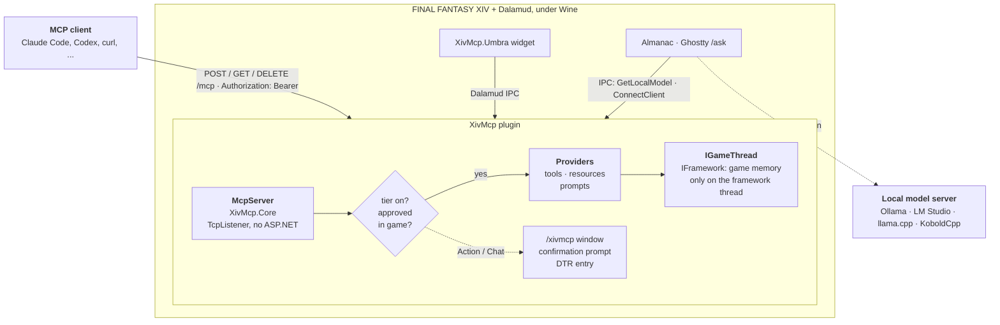
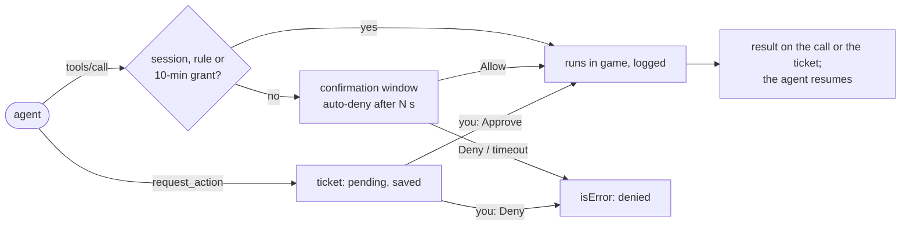
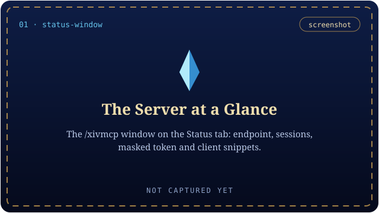
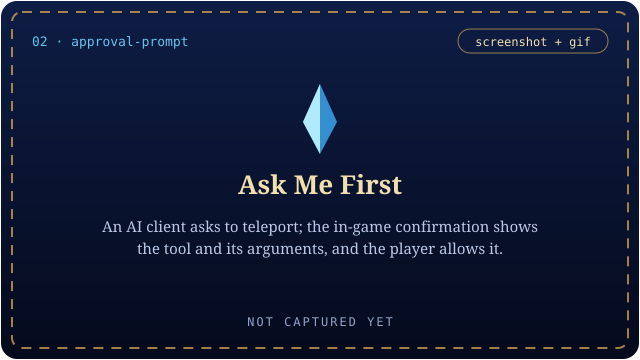
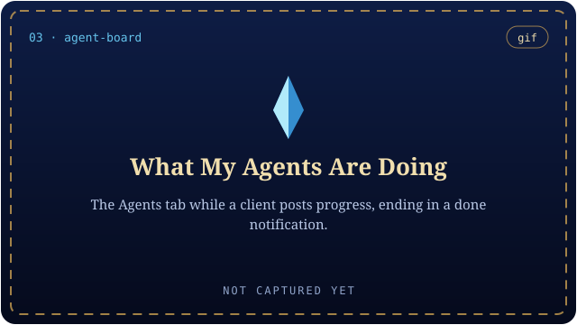
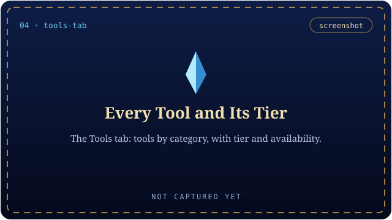
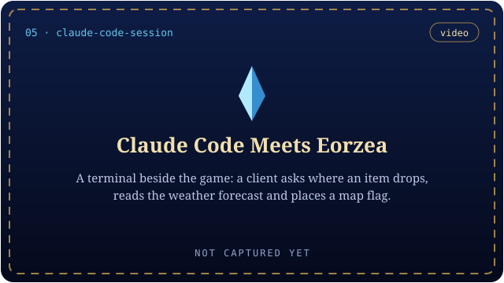
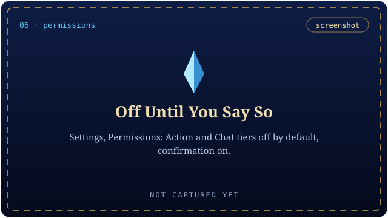
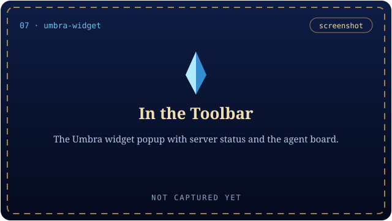

<p align="center">
  <picture>
    <source media="(prefers-color-scheme: dark)" srcset="images/readme/hero-dark.png">
    <source media="(prefers-color-scheme: light)" srcset="images/readme/hero-light.png">
    
  </picture>
</p>

<h1 align="center">XivMcp</h1>

<p align="center"><em>Your game, for your AI assistant: a loopback MCP server inside FINAL FANTASY XIV, with in-game approval.</em></p>

<p align="center">
  <a href="https://github.com/Spaceghost/xivmcp-dalamud/actions/workflows/ci.yml"></a>
  <a href="https://github.com/Spaceghost/xivmcp-dalamud/actions/workflows/quality.yml"></a>
  <a href="https://github.com/Spaceghost/xivmcp-dalamud/actions/workflows/battery.yml"></a>
  <a href="https://github.com/Spaceghost/xivmcp-dalamud/actions/workflows/codeql.yml"></a>
  <a href="https://github.com/Spaceghost/xivmcp-dalamud/actions/workflows/scorecard.yml"></a>
  <br>
  <a href="https://github.com/Spaceghost/xivmcp-dalamud/releases"></a>
  <a href="https://github.com/goatcorp/Dalamud"></a>
  <a href="https://spacegho.st/mods/ffxiv/plugins/"></a>
  <a href="#install"></a>
</p>

<p align="center">
  <a href="https://spacegho.st/mods/ffxiv/xivmcp/">Minisite</a> &nbsp;·&nbsp; <a href="#install">Install</a> &nbsp;·&nbsp; <a href="#connect-a-client">Connect a client</a> &nbsp;·&nbsp; <a href="#tool-catalog">Tool catalog</a> &nbsp;·&nbsp; <a href="docs/">Docs</a> &nbsp;·&nbsp; <a href="CHANGELOG.md">Changelog</a> &nbsp;·&nbsp; <a href="https://spacegho.st/mods/ffxiv/term/vote/">Vote</a>
</p>

<p align="center"></p>

A [Model Context Protocol](https://modelcontextprotocol.io) server that runs **inside FINAL FANTASY XIV** as a
Dalamud plugin. MCP clients such as Claude Code connect to it over Streamable HTTP on loopback
(`http://127.0.0.1:41800/mcp`) and get tools, resources and prompts for game state, game data, the
player's UI and — only when the player opts in — actions and chat. An optional Umbra toolbar widget
shows server status and the agent board.

> [!IMPORTANT]
> **Status.** The plugin builds against Dalamud API 15 (Dalamud 15.0.3.4, .NET 10). The MCP runtime and
> the plugin logic that needs no game (confirmation service, chat rules, IPC payloads, map maths) have host-side
> tests, but **the plugin has not yet been observed running in the game**. Nothing below about in-game behaviour
> has been observed; treat it as the design, not as verified results. [What is verified](#what-is-verified) has the table.

## At a glance

<table>
<tr>
<td width="50%" valign="top">

**A real MCP server, in the game process**<br>
Streamable HTTP on `127.0.0.1:41800/mcp` with a 256-bit bearer token. 65 tools, 12 resources and templates, 6 prompts, generated into the [catalog](#tool-catalog) from the code.

</td>
<td width="50%" valign="top">

**Off until you say so**<br>
Four tiers: **Read** and **Ui** on, **Action** and **Chat** off. Every Action or Chat call waits for an Allow / Deny window in game.

</td>
</tr>
<tr>
<td width="50%" valign="top">

**Approve later**<br>
An agent that runs while you are away files a ticket with `request_action`; it waits, across restarts, until you approve or deny it.

</td>
<td width="50%" valign="top">

**See what your agents are doing**<br>
Agents call `post_status`; their progress shows on the agent board in the `/xivmcp` window, the server info bar and the Umbra widget.

</td>
</tr>
<tr>
<td width="50%" valign="top">

**Objectives the game understands**<br>
Agents post goals with an Eorzea time window, weather, a place and a radius; they sit under the Duty List and flag the map on click.

</td>
<td width="50%" valign="top">

**One hub for local models**<br>
Settings → *Local model* records an OpenAI-compatible server once; Almanac and Ghostty's `/ask` read it over Dalamud IPC.

</td>
</tr>
</table>

## How it fits together



Wine maps `127.0.0.1` inside the game to the host's loopback, so host-side clients reach the plugin
directly. XivMcp does not run a model; it only records where yours is. Details: [docs/ARCHITECTURE.md](docs/ARCHITECTURE.md).

## Install

Two paths, both supported. The plugin repository is one click; building it yourself is the path the author develops on, and
it stays supported for friends and strangers who want to read the code first.

### One click (plugin repository)

XivMcp is listed in the author's own third-party Dalamud repository, next to the other FFXIV mods there.

In game:

1. `/xlsettings` → **Experimental** → **Custom Plugin Repositories** → paste

   ```
   https://spacegho.st/mods/ffxiv/plugins.json
   ```

   → **+** → **Save and close**.
2. `/xlplugins` → **All Plugins** → search **XivMcp** → **Install**.

> [!NOTE]
> **XivMcp is testing-only until its first stable release.** It appears in `/xlplugins` only after you tick
> `/xlsettings` → **Experimental** → **Get plugin testing builds**. The same is true of the other mods in the
> repository except Almanac, which has a stable release.

<https://spacegho.st/mods/ffxiv/plugins/> walks through the same steps and says what every mod in the repository is. It is a
third-party repository, not the official Dalamud one: Dalamud will warn you that nobody but the author has reviewed it,
which is true.

Releases are built on GitHub Actions from a tag (`.github/workflows/release.yml`); `v1.2.3` is a stable release,
`v1.2.3-test.1` moves the floating `testing` release.

### Build it yourself (dev plugin)

Requirements: XIVLauncher.Core with Dalamud 15.0.3.5 (API 15), the .NET 10 SDK on the host (`~/.dotnet/dotnet`
is picked up automatically). Reference assemblies come from `~/.xlcore/dalamud/Hooks/dev/`; rebuild after every
Dalamud update.

```sh
tools/install-dev.sh
```

It builds Release, copies the result into `~/xiv-mcp-build/devplugin/` (so Dalamud never sees a half-written
build) and prints the Wine path of the staged DLL, e.g. `Z:\home\<you>\xiv-mcp-build\devplugin\XivMcp.dll`.
In game, once:

1. `/xlsettings` → **Experimental** → **Dev Plugin Locations**: paste that path, click **+**, then **Save and close**.
2. `/xlplugins` → **Dev Tools** → **Installed Dev Plugins**: Dalamud adds dev plugins **disabled**. Enable
   **XivMcp**, and in its entry tick **Start on boot** (otherwise it stays off after the next game start).
3. `/xivmcp` opens the window. The server starts automatically (Settings → *Start server when the
   plugin loads*).

After rebuilding, run `tools/install-dev.sh` again and reload XivMcp from `/xlplugins` (or tick its **Automatic reloading**
option). If `/xivmcp` is an unknown command, the plugin is not loaded: check steps 1–2 and the Dalamud
log (`~/.xlcore/logs/dalamud.log`, search for `XivMcp`).

The script never edits Dalamud's configuration or copies files into `~/.xlcore`. The optional Umbra
widget has its own installer (`tools/install-umbra.sh`).

## Connect a client

On first load the plugin generates a 256-bit bearer token and stores it in
`~/.xlcore/pluginConfigs/XivMcp.json`. Every request must send `Authorization: Bearer <token>`
(unless you turn *Require bearer token* off).

### Claude Code (recommended)

```sh
tools/claude-mcp-add.sh            # --force to replace an existing "xiv-mcp" entry, --dry-run to preview
```

This registers `xiv-mcp` at **user** scope with `"type": "http"` and a
[`headersHelper`](https://code.claude.com/docs/en/mcp): a small script installed to
`~/.local/share/xiv-mcp/headers-helper` that reads `BearerToken` from the plugin config each time Claude
Code connects. The token is never printed and never stored in Claude's config, and regenerating it in
game only needs a reconnect (`/mcp` in Claude Code).

Pass `--url http://<tailnet-ip>:41800/mcp` to register the tailnet endpoint instead of loopback (see
[Where the server listens](#where-the-server-listens)); on another machine the helper cannot read the
plugin config, so use the generic JSON below with the token instead.

### Anything else

The Status tab has copy buttons for a `claude mcp add --header ...` command and a generic
`mcpServers` JSON block (token masked until you reveal it):

```json
{
  "mcpServers": {
    "xiv-mcp": {
      "type": "http",
      "url": "http://127.0.0.1:41800/mcp",
      "headers": { "Authorization": "Bearer <token>" }
    }
  }
}
```

Smoke test from the host without printing the token:

```sh
TOKEN="$(python3 -c 'import json,os;print(json.load(open(os.path.expanduser("~/.xlcore/pluginConfigs/XivMcp.json"),encoding="utf-8-sig"))["BearerToken"])')"
curl -s http://127.0.0.1:41800/mcp \
  -H "Authorization: Bearer $TOKEN" -H 'Content-Type: application/json' \
  -H 'Accept: application/json, text/event-stream' \
  -d '{"jsonrpc":"2.0","id":1,"method":"initialize","params":{"protocolVersion":"2025-06-18","capabilities":{},"clientInfo":{"name":"curl","version":"0"}}}'
```

## Permission model

Every tool declares one tier. Each tier is a separate toggle (Settings → Permissions); disabled tiers
and categories are hidden from `tools/list` and rejected on call.

| Tier | Default | Meaning |
| --- | --- | --- |
| **Read** | on | Observe game state and static game data. |
| **Ui** | on | Local-only visible effects: echo to your own chat log, toasts, map flags, opening windows, the agent board. |
| **Action** | **off** | Changes your client: targeting, gearsets, teleport, arbitrary slash commands. |
| **Chat** | **off** | Sends text other players can see (say, party, tells, FC, ...). |

> [!WARNING]
> **Game automation through XivMcp is limited to what you approve**: a click, a session you opened, or a rule you
> wrote. Combat rotations, movement and input automation of any kind are out of scope. The confirmation window, the
> Approvals tab and their buttons are **unverified in game**; the server-side hook and the service logic are covered by
> host tests.



<details>
<summary><b>Confirmation, tickets, categories, network rules</b> — the full permission rules</summary>
<br>

- **Confirmation.** *Ask me before every Action/Chat call* (default on): each Action or Chat call waits for the
  in-game confirmation window, which shows the tool, the client-reported name and the pretty-printed arguments, with
  **Allow**, **Deny** and **Allow this tool for 10 min** (same tool, tier and client name; revoked when permissions
  change, listed under Settings). Unanswered calls are denied after *Auto-deny after (s)* (default 20). The client
  gets `isError` "denied in game by the player" or "not confirmed in game within N s", and the tool did not run.
  `execute_command` lines that post chat are shown and granted as Chat. Turning confirmation off makes Action/Chat
  follow their tier toggles directly. **Unverified in game:** the window and its buttons have not been exercised
  inside FINAL FANTASY XIV yet; the server-side hook and the service logic are covered by host tests.
- **Approve later (ticket queue).** An agent that may run while you are away calls `request_action` instead of the
  tool: the call becomes a ticket in the **Approvals** tab and waits, across reloads and game restarts, until you
  approve or deny it. Approved tickets run with the normal checks and call timeout, and the agent picks up the result
  with `get_ticket`/`list_tickets` or a resource subscription and resumes its plan. From a ticket you can also
  **Allow everything from this client for 5 min** (1–60 in Settings; Chat only with a separate checkbox; banner with
  countdown and Revoke; never saved). For unattended CI, a **client token** plus **auto-approve rules** pre-approve
  exact command prefixes for that token only. Details, diagrams and the client resume contract:
  [docs/APPROVALS.md](docs/APPROVALS.md). **Game automation through XivMcp is limited to what you approve**: a click,
  a session you opened, or a rule you wrote. **Unverified in game**, like the confirmation window.

- **Categories** (character, chat, gamedata, ui, meta, prompts, ...) can be switched off individually.
- **Resources** follow the Read tier as well as their category; prompts only return text and follow their category.
- **Network.** The listener binds `127.0.0.1` by default. Any bind that reaches past this machine is
  shown with a red warning and **forces the bearer token on**; the server refuses to start such a bind
  without one. Requests carrying an `Origin` header are accepted only from loopback origins or the
  configured allow-list, and the `Host` header must name loopback, an address the server actually bound,
  or its MagicDNS name (DNS-rebinding defence). See [Where the server listens](#where-the-server-listens).
- **Out of scope:** combat rotations, movement, and input automation of any kind.

</details>

**Local model and companion plugins.** *Settings → Local model* records an OpenAI-compatible local server (Ollama, LM
Studio, llama.cpp, KoboldCpp) with **Detect** and **Test** buttons. XivMcp does not run the model; companion plugins
(Almanac, the Ghostty terminal's `/ask`) read it over Dalamud IPC (`XivMcp.GetLocalModel`) and can connect themselves
with `XivMcp.ConnectClient`, which issues a per-client token (switch: *Let other plugins connect themselves*). Game
actions from those clients still need your in-game approval. Gates and payloads:
[docs/ARCHITECTURE.md](docs/ARCHITECTURE.md#ipc-plugin--umbra).

All settings: [docs/CONFIGURATION.md](docs/CONFIGURATION.md).

## In game

| Command | What it does |
| --- | --- |
| `/xivmcp` | toggles the window |
| `/xivmcp start` · `stop` · `restart` · `status` · `settings` | controls the server, prints its state, opens Settings |
| `/xivmcp quests ...` | custom objectives, e.g. `/xivmcp quests load <file>` |

- **Status**: running state, endpoint, sessions, bind errors, provider load failures, masked token,
  client snippets. **Agents**: the agent board with state colours and progress bars. **Approvals** (with the
  pending count): queued tickets to approve or deny, approval sessions and recent results. **Activity**: live
  request feed with filter; failures highlighted. **Tools**: every registered tool by category with its
  tier and whether it is currently available. **Settings**: everything configurable.
- Server info bar entry `MCP ● n` (n = active sessions; `?` when a confirmation is waiting). Click to
  open the window.
- The agent board: agents call `post_status` to show "what I'm doing" in game (and in the Umbra
  widget); a notification appears when an agent posts `done` or `failed`.
- Custom objectives ("quests"): agents call `post_objective` / `update_objective` (or you load a quest pack with
  `/xivmcp quests load <file>`), and each one appears under the game's Duty List with its current step and a live
  *Ready now* / *Next window in N min* line from its zone, spot, Eorzea time window and weather. Click one to flag it
  on the map. They are **not** Journal quests (those are server-side and cannot be added); they are an overlay drawn to
  match the Duty List. Details and the in-game checklist: [docs/OBJECTIVES.md](docs/OBJECTIVES.md).

## Screens

Nothing has been captured yet, because nothing has been seen in game yet. These are the named slots from the
[minisite](https://spacegho.st/mods/ffxiv/xivmcp/)'s media manifest; a real capture replaces the placeholder of the same
id in `docs/media/` and nothing else moves.

<table>
<tr>
<td width="50%" valign="top"><br><sub><b>The Server at a Glance</b> · <code>status-window</code></sub></td>
<td width="50%" valign="top"><br><sub><b>Ask Me First</b> · <code>approval-prompt</code></sub></td>
</tr>
<tr>
<td width="50%" valign="top"><br><sub><b>What My Agents Are Doing</b> · <code>agent-board</code></sub></td>
<td width="50%" valign="top"><br><sub><b>Every Tool and Its Tier</b> · <code>tools-tab</code></sub></td>
</tr>
</table>

<details>
<summary><b>The other 3 planned shots</b></summary>
<br>

<table>
<tr>
<td width="50%" valign="top"><br><sub><b>Claude Code Meets Eorzea</b> · <code>claude-code-session</code></sub></td>
<td width="50%" valign="top"><br><sub><b>Off Until You Say So</b> · <code>permissions</code></sub></td>
</tr>
<tr>
<td width="50%" valign="top"><br><sub><b>In the Toolbar</b> · <code>umbra-widget</code></sub></td>
<td width="50%"></td>
</tr>
</table>

</details>

## What is verified

● yes &nbsp;·&nbsp; ◐ partly &nbsp;·&nbsp; ○ no &nbsp;·&nbsp; — does not apply. **Seen in game** means observed on that build in a running game; a passing host test never earns it.

| Area | Built | Host tests | Seen in game | Notes |
| --- | :---: | :---: | :---: | --- |
| MCP runtime: protocol, Streamable HTTP transport, sessions, security and hardening | ● | ● | ○ | `tests/XivMcp.Core.Tests`; no Dalamud needed |
| Plugin logic that needs no game: confirmation service, chat rules, IPC payloads, map maths, bind modes, provisioning, objectives | ● | ● | ○ | `tests/XivMcp.Plugin.Tests`; needs the Dalamud dev hooks |
| The plugin loaded in FINAL FANTASY XIV | ● | — | ○ | builds against API 15; **not yet observed running in the game** |
| Providers reading live game state | ● | ○ | ○ | design, not a result |
| Confirmation window, Approvals tab, approval sessions | ● | ◐ | ○ | service logic tested; the windows and buttons are unexercised |
| Tailnet bind modes, provisioning file | ● | ◐ | ○ | resolution and parsing tested; no real tailnet client observed |
| Custom objectives under the Duty List | ● | ◐ | ○ | conditions and store tested; the overlay is unverified, see [docs/OBJECTIVES.md](docs/OBJECTIVES.md) |
| Umbra widgets (`Umbra.XivMcp.dll`) | ● | ◐ | ○ | payload parsing and a stylesheet parse; never loaded in Umbra, see [docs/UMBRA.md](docs/UMBRA.md) |

Host tests prove only what they run; nothing in them loads the plugin in FINAL FANTASY XIV. The
[changelog](CHANGELOG.md) keeps every entry at **BETA** until it has been seen working in the game.

## Reference

<details>
<summary><a name="where-the-server-listens"></a><b>Where the server listens</b> — loopback (default), your tailnet, or a custom address</summary>
<br>

Settings → **Server** → *Where the server listens*. Changing it applies without reloading the plugin:
**Apply and restart server** stops the listener and binds the new addresses in place.

| Mode | Binds | Who can connect |
| --- | --- | --- |
| **This machine only** (default) | `127.0.0.1` | Only this computer. Under Wine that includes clients on the Linux host. |
| **This machine + my tailnet** | `127.0.0.1` **and** this machine's Tailscale address | This computer, plus anything on your tailnet that has the bearer token. |
| **Tailnet only** | the Tailscale address | Your tailnet only; local clients must use that address too. |
| **Custom address…** | whatever you type | Whatever that address is reachable from. |

The plugin finds the Tailscale address itself: it looks for an address in `100.64.0.0/10` (CGNAT) or
`fd7a:115c:a1e0::/48` on the machine's network adapters, preferring an adapter named `tailscale0`/`ts*`.
Detection runs when the server starts and whenever the settings window opens, so a Tailscale restart or a
changed address is picked up. The detected address and, when it can be read, the MagicDNS name are shown
live in Settings along with the endpoint URLs the mode produces.

**If Tailscale is not running or has no address, a tailnet mode falls back to `127.0.0.1`** and says so
in Settings, the Status tab and the log. The server always starts; it never silently binds something
wider than you asked for.

### Reaching the server from another tailnet machine

```sh
curl -s http://<tailnet-ip>:41800/mcp \
  -H "Authorization: Bearer <token>" -H 'Content-Type: application/json' \
  -H 'Accept: application/json, text/event-stream' \
  -d '{"jsonrpc":"2.0","id":1,"method":"initialize","params":{"protocolVersion":"2025-06-18","capabilities":{},"clientInfo":{"name":"curl","version":"0"}}}'
```

The MagicDNS name works in place of the address (`http://<machine>.<tailnet>.ts.net:41800/mcp`) when the
plugin was able to read it — that name is added to the accepted `Host` headers. The Status tab's copy
buttons already use the tailnet address when it is bound, so pasting from there gives a client config
that works from any tailnet machine.

> **Security.** Binding the tailnet means *anyone on your tailnet who has the bearer token can drive your
> game*: every tool tier you have enabled, including Action and Chat if you turned those on, and chat is
> visible to other players. The token is mandatory off loopback and the checkbox is held on. Keep
> Action/Chat confirmation on, and treat the token like a password: regenerate it (Settings → Advanced) if
> it leaks, and remember that tailnet ACLs are what decide who can even reach the port.

</details>

<details>
<summary><a name="provisioning-file-optional"></a><b>Provisioning file</b> — optional, read-only overrides for unattended machines</summary>
<br>

For config management and unattended machines, the plugin reads an optional file that **overrides** the
saved settings while it exists. The plugin only ever reads it — it is never written back, and removing it
restores exactly what you had configured in game.

Location, in order: `$XIVMCP_PROVISION`, else `$XDG_CONFIG_HOME/xiv-mcp/provision.json`, else
`$HOME/.config/xiv-mcp/provision.json`. (Inside the game these Unix paths are reached through Wine's `Z:`
drive automatically.) It is re-read within a few seconds of changing, and a change to the bind settings
restarts the listener without a plugin reload.

```json
{
  "Enabled": true,
  "BindMode": "LoopbackAndTailnet",
  "CustomHost": "198.51.100.7",
  "Port": 41800,
  "Path": "/mcp",
  "RequireToken": true,
  "BearerToken": "REPLACE_WITH_A_43_CHAR_BASE64URL_TOKEN",
  "AllowedOrigins": ["http://192.0.2.10:3000"],
  "CallTimeoutSeconds": 30,
  "ConfirmTimeoutSeconds": 20,
  "DisabledCategories": ["chat"]
}
```

Every key is optional: only the keys present override anything, and Settings greys out exactly those and
names the file they come from. `BindMode` accepts `Loopback`, `LoopbackAndTailnet`, `TailnetOnly` or
`Custom` (`CustomHost` only matters for `Custom`). Unknown keys are ignored.

Because it can carry the bearer token, **write it with mode 0600**:

```sh
install -d -m 700 ~/.config/xiv-mcp
install -m 600 /dev/null ~/.config/xiv-mcp/provision.json   # then write the JSON into it
```

Its contents are never logged — the log records the path, which settings it provisioned and any parse
error, nothing else. A malformed file keeps the last values that loaded, shows the error in Settings and
in the log, and never falls back to a wider bind.

</details>

<details>
<summary><a name="troubleshooting"></a><b>Troubleshooting</b> — port in use, a provider failed to load, missing tools, Claude Code cannot connect</summary>
<br>

- **"Could not start on http://127.0.0.1:41800/mcp: ... address already in use"** — another process
  (or a previous plugin instance that did not unload) holds the port. Change the port in Settings or
  restart the game.
- **A provider shows "failed to load"** — the Status and Tools tabs list the exception; the other
  providers keep working. `/xllog` has the stack trace.
- **Action/Chat tools missing** — they are off by default (Settings → Permissions). `get_server_info` reports the
  enabled tiers. With confirmation on, a call that nobody approves in game fails after the auto-deny time.
- **Claude Code says the connection failed** — the helper exits non-zero if the plugin config does not
  exist yet (load the plugin once) or has no token. Run
  `~/.local/share/xiv-mcp/headers-helper >/dev/null && echo ok` to check without printing the token.

</details>

| Document | What is in it |
| --- | --- |
| [docs/ARCHITECTURE.md](docs/ARCHITECTURE.md) | threads, providers, IPC gates and payloads |
| [docs/PROTOCOL.md](docs/PROTOCOL.md) | the MCP surface the server implements |
| [docs/APPROVALS.md](docs/APPROVALS.md) | tickets, sessions, client tokens, auto-approve rules, the client resume contract |
| [docs/CONFIGURATION.md](docs/CONFIGURATION.md) | every setting |
| [docs/OBJECTIVES.md](docs/OBJECTIVES.md) | custom objectives, quest packs, the in-game checklist |
| [docs/PROVIDERS.md](docs/PROVIDERS.md) | writing a provider |
| [docs/UMBRA.md](docs/UMBRA.md) | the optional Umbra widgets |
| [docs/CI.md](docs/CI.md) | what CI runs, and how to run it locally |

## Tool catalog

Generated from the `[McpTool]`, `[McpResource]`, `[McpResourceTemplate]` and `[McpPrompt]` attributes of the built
plugin by `tools/catalog` (`dotnet run --project tools/catalog -c Release -- readme --write README.md` after building);
do not edit the block by hand.

<details>
<summary><b>Open the catalog</b> — 65 tools, 12 resources and templates, 6 prompts</summary>
<br>

<!-- BEGIN GENERATED CATALOG: dotnet run --project tools/catalog -- readme --write README.md -->

65 tools, 12 resources and templates, 6 prompts. Tier and category are the in-game switches
(Settings → Permissions / Categories); *Login* means the call fails at the title screen. Descriptions are the first
sentence of what clients see; `tools/list` has the full text and schemas. Behaviour in game is unverified unless
stated elsewhere.

### Tools

| Tool | Tier | Category | Login | What it does |
| --- | --- | --- | --- | --- |
| `list_gearsets` | Read | actions | yes | Lists the character's saved gear sets. |
| `list_macros` | Read | actions | yes | Lists the user's macros from the in-game User Macros window: set individual (this character) or shared (all characters on the account), 100 slots each. |
| `clear_target` | Action | actions | yes | Clears the user's current target (like pressing Escape on a target). |
| `equip_gearset` | Action | actions | yes | Equips one of the character's saved gear sets (which also changes class/job when the set belongs to another job), exactly like /gearset change. |
| `set_focus_target` | Action | actions | yes | Sets the user's focus target (the secondary tracked target shown in the Focus Target bar), or clears it with clear=true. |
| `set_target` | Action | actions | yes | Sets the user's current target, like clicking an object. |
| `teleport` | Action | actions | yes | Starts the Teleport spell to one of the character's attuned aetherytes (or free-company/private estate and apartment entries), exactly like choosing it in the Teleport window. |
| `get_ticket` | Read | approvals | no | Returns one of your approval tickets: state (pending, approved, executed, failed, denied, cancelled, expired), who decided, your resumeToken, and once it ran the tool result (result, same shape as a tools/call result)… |
| `list_tickets` | Read | approvals | no | Lists your approval tickets, oldest first. state filters: open (pending or approved, the default), pending, final, all. |
| `cancel_ticket` | Ui | approvals | no | Withdraws one of your pending tickets so the player is no longer asked about it. |
| `request_action` | Ui | approvals | no | Files an Action- or Chat-tier tool call (e.g. teleport, execute_command, send_chat) as an approval ticket and returns immediately with its id and state pending; nothing runs until the player approves it in the XivMcp… |
| `get_conditions` | Read | character | no | The game's condition flags (what state the client is in). |
| `get_job_gauge` | Read | character | yes | The current job's gauge (the job-specific resource UI: e.g. PLD oath, WAR beast gauge, BLM astral fire/umbral ice and polyglot, SAM sen/kenki, VPR rattling coils/serpent offerings, PCT palette/canvas/motifs). |
| `get_job_levels` | Read | character | yes | Every combat class/job, crafter and gatherer with the logged-in character's level and experience. |
| `get_player` | Read | character | yes | Snapshot of the logged-in player character. |
| `get_target` | Read | character | yes | What the player is targeting. |
| `read_chat` | Read | chat | no | Returns chat lines the plugin has captured since it loaded (not older history), oldest first. |
| `print_echo` | Ui | chat | yes | Prints a line into the user's OWN chat log only (tagged [MCP]); nobody else can see it and nothing is sent to the server. |
| `execute_command` | Action | chat | yes | Runs one slash command as if the user typed it into the chat box, e.g. "/gearset change 3", "/hudlayout 2", "/xlplugins" or another installed plugin's command. |
| `send_chat` | Chat | chat | yes | Sends one line of text that OTHER PLAYERS WILL SEE, on the chosen channel, exactly as if the user typed it into the chat box. |
| `get_dalamud_info` | Read | dalamud | no | Returns environment facts about this game client: dalamudVersion, dalamudApiLevel, dalamudScmVersion/gitHash/betaTrack when known, gameVersion (ffxiv) and expansionVersions, clientLanguage (game data language), dalamu… |
| `list_plugins` | Read | dalamud | no | Lists the Dalamud plugins installed in this game client. |
| `get_duty_state` | Read | duty | yes | Instanced-content status. |
| `get_action` | Read | gamedata | no | Details for one action id: name, tooltip description (plain text; dynamic values such as potency may appear as placeholders), icon, class/job and which classes/jobs can use it, level acquired, category (Spell, Weapons… |
| `get_duty` | Read | gamedata | no | Details for one duty (ContentFinderCondition id): name, description, content type, required level and item level, level/item-level sync, party size and role composition (tanks/healers/dps per party, number of parties)… |
| `get_item` | Read | gamedata | no | Full game-data record for one item id: name, description, icon, UI and market categories, item level, equip level and jobs, equip slots, rarity, stack size, flags (unique, untradable, marketable, HQ-able, collectable,… |
| `get_quest` | Read | gamedata | no | Static details for one quest id: name, level, allowed classes/jobs, expansion, journal genre/category/section, place name, issuer NPC with zone and map X/Y coordinates (when the issuer has a placement in game data), p… |
| `get_recipe` | Read | gamedata | no | Crafting recipe for an item (itemId) or a specific recipe (recipeId): craft type (Carpentry, Smithing, ... |
| `get_sheet_row` | Read | gamedata | no | Reads one row of any game Excel sheet by sheet name and row id and returns it as JSON: numbers/bools as values, text as plain strings, RowRef links as {rowId, sheet, name} (name is the linked row's Name/Singular when… |
| `list_sheets` | Read | gamedata | no | Lists game Excel sheets that have typed column definitions (Lumina.Excel.Sheets), optionally filtered by nameContains, with row count, whether rows have subrows, and column names with types (string, uint8..int64, floa… |
| `search_actions` | Read | gamedata | no | Searches actions players can learn (weaponskills, spells, abilities, role actions, gathering abilities, PvP actions; from the Action sheet — crafting actions such as Basic Synthesis live in the CraftAction sheet, see… |
| `search_duties` | Read | gamedata | no | Searches duties from the Duty Finder data (ContentFinderCondition: dungeons, guildhests, trials, raids, alliance raids, PvP, deep dungeons, variant/criterion, etc.) by name (ranked exact > prefix > word > substring; n… |
| `search_items` | Read | gamedata | no | Searches every item in the game data (not the player's inventory; use find_owned_items for that) by name in the client language, ranked exact match > prefix > word prefix > substring > all words present; a numeric que… |
| `search_quests` | Read | gamedata | no | Searches quests by name (ranked exact > prefix > word > substring; a numeric query matches the quest id). |
| `search_recipes` | Read | gamedata | no | Searches crafting recipes by the crafted item's name (ranked exact > prefix > word > substring; numeric query matches the recipe id), optionally filtered by craftType (crafter name like "Weaving"/"Weaver", abbreviatio… |
| `search_sheet` | Read | gamedata | no | Scans one column of any Excel sheet and returns matching rows as {rowId, subrowId, label, value}, where label is the row's Name/Singular when it has one. |
| `find_owned_items` | Read | inventory | yes | Searches every loaded container (bags, equipped, armory, crystals, currency, key items, saddlebags if opened this session, and the currently/last opened retainer's inventory, equipment and market listings) for items b… |
| `get_currencies` | Read | inventory | yes | The character's currency balances: gil; Grand Company seals for the current company with its cap; and a list of currencies with category (common: ventures, MGP; tomestone: every current tomestone with weeklyAcquired/w… |
| `get_equipment` | Read | inventory | yes | The character's currently equipped gear: for each occupied slot (MainHand, OffHand, Head, Body, Hands, Legs, Feet, Ears, Neck, Wrists, RingRight, RingLeft, SoulCrystal) the item id, name, item level, equip level, HQ,… |
| `get_inventory` | Read | inventory | yes | Lists items in the character's containers, slot by slot. containers selects groups: bags (4 main inventory pages), equipped, armory (armoury chest), crystals, currency, keyItems, saddlebag, premiumSaddlebag, retainer… |
| `get_retainers` | Read | inventory | yes | The character's retainers in display order: id, name, whether the slot is available (subscription), class/job and level, gil held, number of items in its inventory and on the market board, market listing expiry, marke… |
| `get_server_info` | Read | meta | no | Describes this XivMcp server: plugin version, endpoint, running state, connected clients, which permission tiers are currently allowed (read, ui, action, chat — and whether Action/Chat calls need in-game approval), ea… |
| `list_status` | Read | meta | no | Returns every entry on the in-game agent board (newest update first) with agent, status, state (running\|done\|failed\|info), progress, detail, the MCP client that posted it and seconds since its last update (ageSeconds). |
| `clear_status` | Ui | meta | no | Removes your entry (pass agent) or every entry (omit agent) from the in-game agent board. |
| `post_status` | Ui | meta | no | Shows your progress inside the player's game: creates or replaces the board entry for `agent` (one entry per agent name, case-insensitive) in the XivMcp window and Umbra toolbar widget. |
| `list_objectives` | Read | objectives | no | Every custom objective in insertion order with steps, location, conditions and live status: ready (in the zone, within the radius, inside the Eorzea time window and weather), summary (the line the player sees, e.g. "N… |
| `clear_objectives` | Ui | objectives | no | Removes one objective (id), every completed one (completedOnly=true) or all of them (no arguments). |
| `load_objective_pack` | Ui | objectives | no | Loads many objectives at once from a quest pack: pass the JSON text (json) or a file path on the player's machine (path; host paths such as /home/me/pack.json or ~/pack.json are mapped to Wine's Z: drive). |
| `post_objective` | Ui | objectives | no | Creates or replaces (same id) a custom objective that the player sees in game like a tracked quest: title and current step under the Duty List, live 'ready now' / 'next window in N min' state, click to place the map f… |
| `update_objective` | Ui | objectives | no | Reports progress on an objective posted with post_objective or loaded from a pack: advance=true marks the current step done (after the last step the objective completes), step=N makes step N (0-based) current with eve… |
| `get_party` | Read | party | yes | The player's party. mode is solo \| party \| crossRealmParty \| alliance. members (the 8-slot party list; empty when solo) each have index, name, contentId (string), entityId, homeWorld, job {abbreviation, name, role}, l… |
| `get_collection_progress` | Read | progress | yes | Unlock progress for one collection kind: mounts, minions, orchestrion (orchestrion rolls), emotes, fashionAccessories (also accepted as ornaments), triadCards (Triple Triad cards), bardings (chocobo barding), glasses… |
| `get_quest_status` | Read | progress | yes | For each quest id (Quest sheet row id; short ids below 65536 are accepted): whether the character has completed it, whether it is currently accepted (in the journal) and its current sequence step, plus name and whethe… |
| `get_addon_text` | Read | ui | yes | Reads every text string shown in one game UI window (addon), including text inside nested components such as lists, buttons and tabs, in reading order (top-to-bottom, left-to-right by screen position). |
| `get_dialogue` | Read | ui | yes | Returns whatever conversation or prompt windows are currently visible, read-only: talk (NPC speaker + dialogue text of the current Talk box), subtitle (cutscene subtitle), selectString / selectIconString (the option l… |
| `list_addons` | Read | ui | yes | Lists the game's loaded UI windows ("addons") with their internal names, which get_addon_text needs. |
| `set_map_flag` | Ui | ui | yes | Places the user's map flag marker (the one shown on the map/minimap and inserted by <flag> in chat) and by default opens the map window on it. |
| `show_notification` | Ui | ui | no | Shows a Dalamud overlay notification card (bottom-right corner, with title, text and a coloured icon for the type) visible only to the user; works on the title screen too. |
| `show_toast` | Ui | ui | yes | Shows a short, transient on-screen message using the game's own toast styles, visible only to the user: normal (small banner near the top of the screen), quest (large centred quest-style text with a chime), error (red… |
| `get_location` | Read | world | yes | Where the player is. |
| `get_time` | Read | world | no | Current Eorzea time and the real-world reset schedule. |
| `get_weather_forecast` | Read | world | no | Weather forecast for a zone computed with the game's own deterministic weather algorithm (weather changes every 8 Eorzea hours = 23m20s real time, at ET 00:00, 08:00 and 16:00). |
| `list_aetherytes` | Read | world | yes | The player's teleport list (the in-game Teleport window): every attuned aetheryte plus housing destinations (own/FC house, shared estates, apartments). |
| `list_fates` | Read | world | yes | FATEs currently known in the player's zone, nearest first. |
| `list_nearby_objects` | Read | world | yes | Game objects loaded around the player (the client only knows objects within roughly 100 yalms, fewer in crowded areas), sorted nearest first; the local player is excluded. |

### Resources

Resources and templates follow the Read tier and their category.

| URI | Category | Login | What |
| --- | --- | --- | --- |
| `ffxiv://tickets` | approvals | no | Your approval tickets (same shape as list_tickets with state all). |
| `ffxiv://tickets/{id}` | approvals | no | One of your approval tickets (same shape as get_ticket). |
| `ffxiv://player` | character | yes | Same JSON as the get_player tool: the logged-in character's identity, job, level, HP/MP, position, statuses. |
| `ffxiv://target` | character | yes | Same JSON as get_target (target, target of target, soft, focus, mouseover). |
| `ffxiv://chat/recent` | chat | no | The newest 100 captured chat lines (oldest first) in the same shape as read_chat, excluding private tells and battle-log lines. |
| `ffxiv://item/{itemId}` | gamedata | no | Game-data record for an item id (same content as the get_item tool). |
| `ffxiv://sheet/{sheet}/{rowId}` | gamedata | no | One Excel sheet row as JSON (same content as get_sheet_row with default options). |
| `ffxiv://inventory` | inventory | yes | Main inventory bags (4 pages) with per-container usage; updated notifications are sent when the inventory changes. |
| `ffxiv://agents` | meta | no | JSON snapshot of the in-game agent board (same shape as list_status). |
| `ffxiv://objectives` | objectives | no | Same JSON as list_objectives (with completed ones). |
| `ffxiv://party` | party | yes | Same JSON as get_party. |
| `ffxiv://location` | world | yes | Same JSON as get_location. |

### Prompts

Prompts only return instructions; every game interaction still goes through tools and their tiers.

| Prompt | Category | Arguments | Workflow |
| --- | --- | --- | --- |
| `character_overview` | prompts | — | Summarize the logged-in character: jobs and levels, current gear, location, party and notable currencies. |
| `crafting_plan` | prompts | `item`, `quantity?` | Plan how to craft an item: full ingredient tree, what is already owned, what to gather or buy, and crafter level checks. |
| `duty_prep` | prompts | `duty` | Prepare for a duty: requirements vs. my character, party composition, gear readiness and useful reminders. |
| `gear_audit` | prompts | `job?` | Audit equipped gear for a job: item level outliers, missing materia or upgrades available in inventory or gearsets. |
| `situation_report` | prompts | — | What is going on around me right now: zone, Eorzea time, weather, active FATEs, duty and party state, recent chat. |
| `where_is` | prompts | `target` | Locate a nearby object, NPC, player or a place and explain how to get there, optionally flagging the map. |

<!-- END GENERATED CATALOG -->

</details>

## Development

```sh
export DOTNET_CLI_TELEMETRY_OPTOUT=1 DOTNET_NOLOGO=1
~/.dotnet/dotnet build XivMcp.slnx -c Release
```

Build output goes to `../xiv-mcp-build/artifacts` (override with `XIVMCP_ARTIFACTS`), never into the
source tree. Writing a provider: [docs/PROVIDERS.md](docs/PROVIDERS.md).

```sh
~/.dotnet/dotnet test tests/XivMcp.Core.Tests -c Release     # protocol, transport, approval hook (no Dalamud)
~/.dotnet/dotnet test tests/XivMcp.Plugin.Tests -c Release   # plugin logic without the game (needs Dalamud dev hooks)
~/.dotnet/dotnet run --project tools/catalog -c Release -- readme --write README.md   # regenerate the catalog above
```

Host tests prove only what they run; nothing in them loads the plugin in FINAL FANTASY XIV.

CI runs the same tests and build through one script, `tools/ci/run.sh` (locally: `tools/ci/local.sh`):
[docs/CI.md](docs/CI.md).

<details>
<summary><a name="changelog"></a><b>Changelog convention</b> — one source, `changelog.json`; what SOON, BETA and NEW mean</summary>
<br>

`changelog.json` at the top of the repository is the changelog, and the only place entries are
written. Both places a user reads it come from that one file: the plugin embeds it
(`XivMcp.Core.Changelog`) and shows it in the **What's new** tab, and
[CHANGELOG.md](CHANGELOG.md) is rendered from it.

```sh
tools/changelog.py           # rewrite CHANGELOG.md from changelog.json
tools/changelog.py --check   # fails, with a diff, when they drift
```

The convention, and it is not optional: **every change a user can see adds or edits its entry in
`changelog.json` in the same commit as the change**, and regenerates `CHANGELOG.md`. Never edit
`CHANGELOG.md` by hand. `tests/XivMcp.Core.Tests` runs the check (it shells out to
`tools/changelog.py`, so there is only one renderer), which means `dotnet test` and any CI that runs
the tests catch drift.

A status word means exactly the same thing here as in Ghostty for FFXIV's changelog, and nothing
more:

| Status | Shown | Means |
| --- | --- | --- |
| `next` | SOON | still being built, on a branch; not merged. |
| `beta` | BETA | merged, but **not yet verified in game**. |
| `new` / `fix` | NEW / FIX | in a numbered release: seen working in game. |

An entry keeps its `beta` until the thing it describes has been observed working in the game. Say
what is unverified in the entry itself rather than writing around it.

</details>

## The family

Four mods, one plugin repository, one look. They work alone and better together.

<table>
<tr>
<td width="96" align="center"><a href="https://github.com/Spaceghost/ghostty-dalamud"></a></td>
<td valign="top"><b><a href="https://github.com/Spaceghost/ghostty-dalamud">Ghostty for FFXIV</a></b><br>A real terminal in the game: a glass dropdown, tabs, and screens you pin in the world.<br><sub><a href="https://spacegho.st/mods/ffxiv/term/">minisite</a> · <a href="https://github.com/Spaceghost/ghostty-dalamud"><code>Spaceghost/ghostty-dalamud</code></a></sub></td>
</tr>
<tr>
<td width="96" align="center"><a href="https://github.com/Spaceghost/xivmcp-dalamud"></a></td>
<td valign="top"><b><a href="https://github.com/Spaceghost/xivmcp-dalamud">XivMcp</a></b> &nbsp;<sub>(you are here)</sub><br>An MCP server inside the game, so your own AI client can read it and, with your approval, act.<br><sub><a href="https://spacegho.st/mods/ffxiv/xivmcp/">minisite</a> · <a href="https://github.com/Spaceghost/xivmcp-dalamud"><code>Spaceghost/xivmcp-dalamud</code></a></sub></td>
</tr>
<tr>
<td width="96" align="center"><a href="https://github.com/Spaceghost/xivdesktop-dalamud"></a></td>
<td valign="top"><b><a href="https://github.com/Spaceghost/xivdesktop-dalamud">XivDesktop</a></b><br>A launcher, workspaces and a taskbar for Linux desktop apps shown as panels in the world.<br><sub><a href="https://spacegho.st/mods/ffxiv/xivdesktop/">minisite</a> · <a href="https://github.com/Spaceghost/xivdesktop-dalamud"><code>Spaceghost/xivdesktop-dalamud</code></a></sub></td>
</tr>
<tr>
<td width="96" align="center"><a href="https://github.com/Spaceghost/almanac-dalamud"></a></td>
<td valign="top"><b><a href="https://github.com/Spaceghost/almanac-dalamud">Almanac</a></b><br>A model on your own GPU, in game chat, with XivMcp's tools and a community benchmark.<br><sub><a href="https://spacegho.st/mods/ffxiv/almanac/about/">minisite</a> · <a href="https://github.com/Spaceghost/almanac-dalamud"><code>Spaceghost/almanac-dalamud</code></a></sub></td>
</tr>
</table>

<p align="center"></p>

<p align="center">
  <a href="https://spacegho.st/mods/ffxiv/">All mods</a> &nbsp;·&nbsp;
  <a href="https://spacegho.st/mods/ffxiv/xivmcp/">XivMcp minisite</a> &nbsp;·&nbsp;
  <a href="https://spacegho.st/mods/ffxiv/plugins/">Plugin repository</a> &nbsp;·&nbsp;
  <a href="https://spacegho.st/mods/ffxiv/term/vote/">Vote on features</a> &nbsp;·&nbsp;
  <a href="https://spacegho.st/mods/ffxiv/term/gallery/">Gallery</a> &nbsp;·&nbsp;
  <a href="https://spacegho.st/mods/ffxiv/almanac/">Model leaderboard</a> &nbsp;·&nbsp;
  <a href="https://github.com/Spaceghost/xivmcp-dalamud/blob/master/CHANGELOG.md">Changelog</a>
</p>

<p align="center"><sub>Made by <b>Johnneylee Jack Rollins</b> · <a href="https://github.com/Spaceghost">github.com/Spaceghost</a><br>
FINAL FANTASY XIV © SQUARE ENIX CO., LTD. These are independent fan projects, not affiliated with or endorsed by Square Enix, Dalamud or XIVLauncher.</sub></p>
