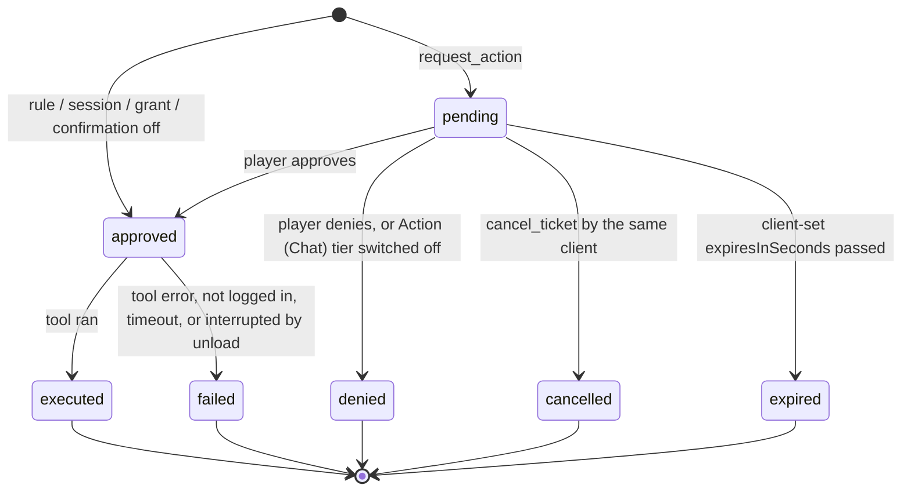

# Approvals: prompts, the ticket queue, sessions and CI rules

> **Status.** Everything here is implemented and covered by host tests
> (`tests/XivMcp.Plugin.Tests/Approval*Tests.cs`, `AutoApprovePolicyTests.cs`,
> `tests/XivMcp.Core.Tests/ApprovedExecutionTests.cs`, `ClientTokenTests.cs`). None of it has been observed inside
> FINAL FANTASY XIV yet: the Approvals tab, the session banner, the toasts, the Settings sections and ticket execution
> against real game state are unverified in game.

Automation through XivMcp is limited to what the player approves. An agent can *ask* for Action and Chat calls at any
time, but they run only when the player clicks Allow or Approve, when the player has opened an approval session for
that client, or when the player wrote a rule for that client's token. Nothing here lets a client approve its own calls.

**All of this sits under one switch.** *Ask me before anything changes* (`ConfirmActions`, top of Settings, on by
default) is the single place that decides whether the player is asked at all. With it off, every state-changing call
runs at once and tickets are approved on arrival ("confirmation off"); each call is still written to the action log
(Approvals tab and `actions.log`: tool, summary, client, token, time, approval on/off, outcome), and chat or gear
changes still show a notification. With it on, the prompt and the ticket lead with the tool's own one-sentence
description of what will happen (chat text verbatim), and Ui tools that leave something behind (`set_map_flag`,
opening windows) are asked about too — sessions, grants and rules treat those as Action. What no setting unlocks is in
[HARD-LINES.md](HARD-LINES.md).

## How a call is decided

```
tools/call (Action/Chat tool)                       request_action (Ui tool)
        |                                                   |
        v                                                   v
  tier/category/argument/login checks            same checks (CheckToolCall), queue limits
        |                                                   |
        v                                                   v
  +-----------------------------------------------------------------+
  | Runs without asking when, in this order:                         |
  |  1. "Ask me before Action/Chat calls" is off                     |
  |  2. an auto-approve rule matches the client's *token* identity   |
  |  3. an approval session covers the client (Chat only if allowed) |
  |  4. an "Allow this tool for 10 min" grant matches                |
  +-----------------------------------------------------------------+
        | no                                                | no
        v                                                   v
  confirmation window, auto-deny after N s        ticket stays PENDING (survives restarts)
  (unchanged interactive path)                    until the player approves or denies it
        | Allow                                             | Approve (one, per client, or all)
        v                                                   v
      runs, result returned to the waiting call       runs one at a time, result stored on the ticket
```

Ticket lifecycle:



A pending ticket never turns into a denial by waiting. The only timers are the client's own optional expiry and the
7-day retention of finished tickets.

## The ticket queue

- **request_action** (Ui tier): `tool`, `arguments` (exactly as for `tools/call`), `reason` (one line shown to the
  player, max 300 chars), optional `resumeToken` (max 512 chars, returned verbatim) and optional `expiresInSeconds`
  (30 s to 7 days). Returns the ticket at once. The target tool must be an Action or Chat tool that could run now
  (category and tier enabled, arguments bind); Read and Ui tools are refused with "call it directly".
- **get_ticket** / **list_tickets** (Read tier; `list_tickets` filters `open` (default), `pending`, `final`, `all` and
  by `resumeToken`) and **cancel_ticket** (Ui tier; pending tickets only). Every tool and resource shows only the
  calling client's tickets (matched by the client-reported name and version).
- Resources `ffxiv://tickets` and `ffxiv://tickets/{id}`: subscribe (`resources/subscribe`, or a 2026-07-28
  `subscriptions/listen` filter) to get `notifications/resources/updated` on every change.
- On approval the plugin runs the call through `McpServer.ExecuteApprovedToolAsync`: the same category, tier, argument
  and login checks and the same call timeout as `tools/call`, without asking again. Approved tickets run one at a time
  in approval order. The ticket keeps the `tools/call` result object (`content`, `structuredContent`, `isError`), capped
  at 32 KB (`truncated: true` when cut).
- Tickets are stored in `approval-tickets.json` in the plugin config directory (next to `XivMcp.json`, which already
  holds the bearer token) and survive plugin reloads and game restarts. A ticket that was approved or running when the
  plugin unloaded is loaded as **failed** ("Interrupted … not retried"): its outcome is unknown, so it is never run twice.
- Limits: 50 pending tickets per client, 200 in total, arguments up to 16 KB of JSON. Errors say which limit was hit
  and suggest `cancel_ticket`.
- Switching the **Action** tier off denies every pending ticket and refuses new ones; switching **Chat** off denies
  pending Chat-tier tickets. A ticket approved just before the tier went off fails instead of running.
- The player sees tickets in the XivMcp window's **Approvals** tab (the tab label carries the pending count): tool,
  tier, client, reason, age, expiry, the arguments (pretty-printed, invisible characters shown as `\uXXXX`), **Approve**,
  **Deny**, **Approve all**, **Deny all**, **Clear finished**, and the recent results. The quest-tracker area is not used
  yet; `ApprovalQueue.Changed`/`Snapshot()` are the hook for an objectives feature to show tickets there later.

## Resume contract (for clients)

1. For each step that needs an Action/Chat call while the player may be away, call `request_action` with a
   `resumeToken` that identifies the step in your own plan (for example `"plan-42/step-3"`), and remember the returned
   `id`. Continue with work that does not depend on it.
2. Learn the outcome either way:
   - subscribe to the ticket's `uri` (`ffxiv://tickets/<id>`) or to `ffxiv://tickets` and re-read on
     `notifications/resources/updated`; or
   - poll `get_ticket(id)` or `list_tickets(state: "open")` at a modest interval (tens of seconds; the player may take
     hours).
3. When the ticket is final:
   - `executed`: `result` is the tool's `tools/call` result. Find your step by `resumeToken` and continue the steps that
     depended on it, using `result` as if you had called the tool yourself.
   - `failed`: `error` says why (tool error, not logged in, timeout, or interrupted by an unload). Check game state
     before asking again.
   - `denied`: the player said no. Do not re-request the same call unless the player asks.
   - `cancelled` / `expired`: your own cancel or expiry.
4. After a restart of your client, `list_tickets(state: "all")` (or `resumeToken: "..."`) recovers your tickets as long
   as you reconnect with the same client name and version. Finished tickets are kept for 7 days or until the player
   clears them.
5. `list_tickets` returns `sessionActiveUntil` while the player has an approval session open for you; during it,
   `request_action` tickets come back `approved` and run immediately.

## Approval sessions (sudo-like)

From a pending ticket, **Allow everything from this client for N min…** opens a dialog. Starting the session makes that
client's Action calls, through `tools/call` and through the queue, run without a prompt until it ends. **Chat** (text
other players can see) needs the separate **Also allow Chat** checkbox, which is off by default.

- Length: *Approval session length (min)* in Settings, default 5, 1 to 60.
- Identity: the client-reported name and version plus, when the client has one, its MCP session id (`Mcp-Session-Id`).
  A client that reconnects with a new MCP session is not covered. Clients on the stateless 2026-07-28 protocol have no
  session id and are matched by name only. The name is self-reported; the dialog says so.
- A countdown banner with **Revoke** sits at the top of the XivMcp window for each session; a toast appears when a
  session starts and when it ends (expired, revoked, or permissions changed).
- Sessions live in memory only: a plugin reload or game restart ends them. Changing tiers, categories or the
  confirmation toggle revokes them, like the 10-minute per-tool grants, which keep working unchanged.
- Starting a session does not approve tickets that are already waiting; use **Approve all** for those.

## Auto-approve rules and client tokens (CI)

For a runner that exercises the game unattended (for example GitHub Actions on a self-hosted runner next to the game),
Settings → **Client tokens and auto-approve rules (CI)**:

1. **Generate token for this client** with a name such as `ghostty-ci`. The token is shown once; only its SHA-256 is
   saved. The client sends it as `Authorization: Bearer <token>`. It has the same server access as the main token, but
   requests made with it carry the name as `ToolContext.AuthenticatedClient`, which the client cannot choose (unlike
   `clientInfo.name`). **Revoke** takes effect on the next request.
2. Add a rule: client token, tool (for example `execute_command`), the argument to check (default `command`) and the
   allowed prefixes, one per line (for example `/term selftest`, `/xivmcp quests`).

A value matches a prefix when it equals the prefix, or continues after it with a space and only ASCII letters, digits
and ``space - _ . , : = / + @ # % ( ) [ ] { } ! ? ~ * ' "``. Matching is case-sensitive with no trimming or
normalization, so `/term selftest; /say hi`, `/term selftest\n/say hi`, `/term selftestX`, a leading space, fullwidth
characters and invisible characters never match. A rule with no prefixes matches any arguments, except for
`execute_command`, where it never matches. Calls that post chat need the rule's **Include Chat**. Read and Ui tools
need no rule; they never prompt.

Everything else from that client is prompted or queued as usual. Every auto-approved call is written to the activity
feed (`policy/auto-approve`, tool, tier and the matching rule and prefix) and to `/xllog`; the call's arguments are not.

## What is logged

The Activity tab and `/xllog` get `tickets/request|approve|deny|cancel|expire|execute`, `sessions/start|end` and
`policy/auto-approve` entries with the tool, ticket id, client, who decided and the outcome or error. Arguments and
tokens are never logged; the reason text and arguments appear only in the Approvals tab and in the ticket file. There is
no key-based secret redaction of arguments: like the confirmation window, the Approvals tab shows the arguments the
player is approving, with invisible characters made visible.
